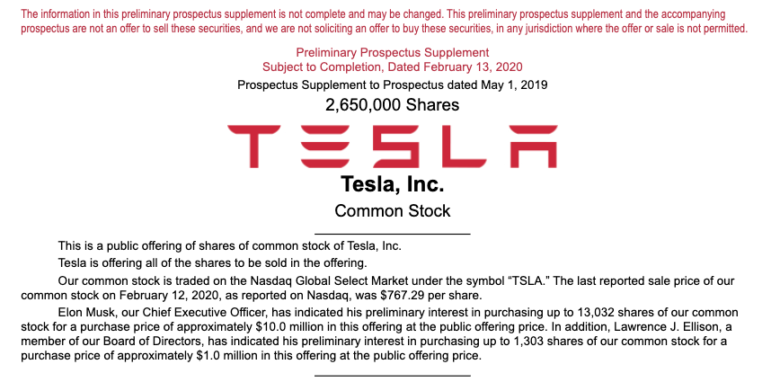

2020年2月13日，Tesla 向 SEC 披露它准备以每股 767.29 的价格增发 2,650,000 股票，其中 Musk 准备认购  13,032 股，它的好友兼董事会成员 Ellison 准备认购 1,303 股。

一般公司当期价值不变，增发股票会稀释每股价值，也就是说股票有下跌倾向，本文主要就是来聊聊怎么自己看和确认细节，在 SEC Edgar Search TSLA 后找到 Tesla 在 2月13日 提交的 Form 424b5，直接打开就可以看到以下

Origin from : [424B5 1 d861752d424b5.htm 424B5
](https://www.sec.gov/Archives/edgar/data/1318605/000119312520034289/d861752d424b5.htm#supptoc861752_5)

一切不言自明，Tesla 增发2,650,000 股票，总计2,033,318,500（2,650,000 * 767.29） 美元的发行规模，其中 Elon Musk 准备认购  9,999,323.28（13,032 * 767.29）美金，它的好友兼董事会成员 Lawrence J Ellison 认购 999,778.87（1,303 * 767.29）美元。

## SEC Form 424(b)(#)  Prospectuses

Prospectuses 用来补充披露公司之前递交的招股说明书中的遗漏的部分信息或者构成实质性变更的部分信息

相应的说明在以下的法律文件有具体定义：

17 CFR § 230.424 - Filing of prospectuses, number of copies. 
https://www.law.cornell.edu/cfr/text/17/230.424

## SEC Form 424(b)(5)

424(b)(5) 也就是本文 Tesla 补充更新之前披露的424(B)(2) 和 424(b)(3)文件，记录它的股票增发信息

>SEC Form 424B5 is the prospectus form that companies must file to disclose information 
>referred to in forms 424B2 (filed in connection with a primary offering of securities) and 
>424B3 (filed if major changes have occurred to the prospectus). SEC Form 424B5 
>outlines updated prospectus information, facts or events from previously-filed forms.
>
>Origin from : https://www.investopedia.com/terms/s/sec-form-424b5.asp

primary offering is also known as "IPO".

> **(5)** A form of prospectus that discloses information, facts or events covered in both paragraphs (b) (2) and (3) shall be filed with the Commission no later than the second business day following the earlier of the date of the determination of the offering price or the date it is first used after effectiveness in connection with a public offering or sales, or transmitted by a means reasonably calculated to result in filing with the Commission by that date.
>
> Origin from : https://www.law.cornell.edu/cfr/text/17/230.424

## SEC Form 424(b)(2)

>**(2)** A form of prospectus that is used in connection with a primary offering of securities pursuant to Rule 415(a)(1)(x) (§ 230.415(a)(1)(x)) or a primary offering of securities registered for issuance on a delayed basis pursuant to Rule 415(a)(1)(vii) or (viii) (§ 230.415(a)(1)(vii) or (viii)) and that, in the case of Rule 415(a)(1)(viii) discloses the public offering price, description of securities or similar matters, and in the case of Rule 415(a)(1)(vii) and (x) discloses information previously omitted from the prospectus filed as part of an effective registration statement in reliance on Rule 430B (§ 230.430B), or, in the case of asset-backed securities, Rule 430D (§ 230.430D) shall be filed with the Commission no later than the second business day following the earlier of the date of the determination of the offering price or the date it is first used after effectiveness in connection with a public offering or sales, or transmitted by a means reasonably calculated to result in filing with the Commission by that date.
>
>Origin from : https://www.law.cornell.edu/cfr/text/17/230.424

## SEC Form 424(b)(3)

> **(3)** A form of [prospectus](https://www.law.cornell.edu/cfr/text/17/230.424) that reflects facts or events other than those covered in paragraphs (b) (1), (2) and (6) of this section that constitute a substantive change from or addition to the information set forth in the last form of [prospectus](https://www.law.cornell.edu/cfr/text/17/230.424) filed with the [Commission](https://www.law.cornell.edu/cfr/text/17/230.424) under this section or as part of a registration statement under the [Securities Act](https://www.law.cornell.edu/cfr/text/17/230.424) shall be filed with the [Commission](https://www.law.cornell.edu/cfr/text/17/230.424) no later than the fifth [business day](https://www.law.cornell.edu/cfr/text/17/230.424)after the date it is first used after effectiveness in connection with a public offering or sales, or transmitted by a means reasonably calculated to result in filing with the [Commission](https://www.law.cornell.edu/cfr/text/17/230.424) by that date.
>
> Origin from : https://www.law.cornell.edu/cfr/text/17/230.424

最后得提一点就是有些增发并不一定是意味着股票下行，那只是一般状况，还要从股票基本面，当前所处的环境和状态，对将来的预期还有 CEO 把握战略节奏的能力去判断

_有些往细了看挺头疼的，有空再研究，To be continued_

------

> **学习型的投资者可以加入我的讨论组进行交流讨论**     
>
> Finance Group in Telegram : [_My Financial Telegram Group_](https://t.me/joinchat/JAgU_xVgurGtCieh5GQ56g)   
> Finance Group in Discord : [_My Financial Discord Group_](https://discord.gg/NgWdjb)
> 微信讨论群可以关注微信公众号:  iLeonVision 发信息跟我要进群二维码

------

## Reference 

_17 CFR § 230.424 - Filing of prospectuses, number of copies._
https://www.law.cornell.edu/cfr/text/17/230.424