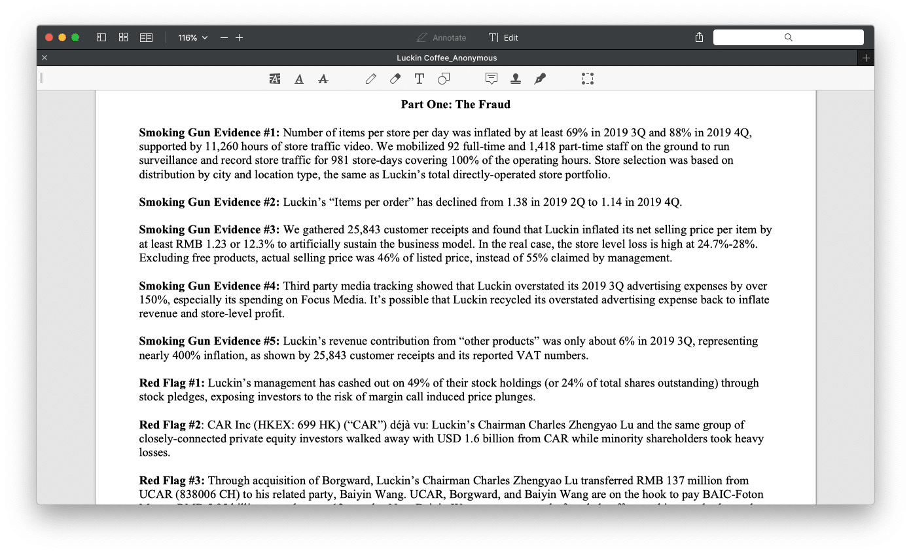

浑水（ Muddy Waters Research )  做空瑞幸（ Luckin Coffee ）的报告，第一页打开就列举了一些 Smoking Gun Evidence and Red Flag 

但是我只是隐约感到这两个词语是什么意思，理解得也不是很好，似乎挺有意思的，所以网上对报告的整体解读已经很多了，但是小白我还是先从英文单词学起 (///▽///) 

**Smokng Gun Evidence**

>The term "smoking gun" is a reference to an object or fact that serves as conclusive evidence of a crime or similar act, just short of being caught in flagrante delicto. "Smoking gun" refers to the strongest kind of circumstantial evidence, as opposed to direct evidence. Direct evidence would include the entire action: Pulling the trigger, firing the gun, and the victim falling.[1]
>https://en.wikipedia.org/wiki/Smoking_gun

可以看出 Smoking Gun Evidence 就是那种一击送你归天的铁证

**Red Flag**

>The term red flag could mean either a literal flag used for signaling or, as a metaphor, a sign of some particular problem requiring attention.[2]
>https://en.wikipedia.org/wiki/Red_flag_(idiom)

Red Flag 比较容易理解了，就是风险提示了

理解了后会发现中文翻译其实没有英文本身意会来得有意思，有木有？！

> 钛媒体 报告作者对指控瑞幸造假欺诈列举了五大确凿铁证（SmokingGun Evidence）、六大风险警告（Redflag） 和五大商业模式缺陷，称其对981个门店进行了追踪，派出了92个全职和1400个兼职调查员，向超过1万名用户收集了25000多张用户小票 ，进行了11260个小时的门店录像，并且收集了大量内部微信聊天记录，真可谓下足了血本。
>
> 

_这次 NW 来势汹汹，LK大概率得跪一下，先这样，要写的东西太多了，有空再继续写_

------

> **学习型的投资者可以加入我的讨论组进行交流讨论**     
>
> Finance Group in Telegram : [_My Financial Telegram Group_](https://t.me/joinchat/JAgU_xVgurGtCieh5GQ56g)   
> Finance Group in Discord : [_My Financial Discord Group_](https://discord.gg/NgWdjb)
> 微信讨论群可以关注微信公众号:  iLeonVision 发信息跟我要进群二维码

------

