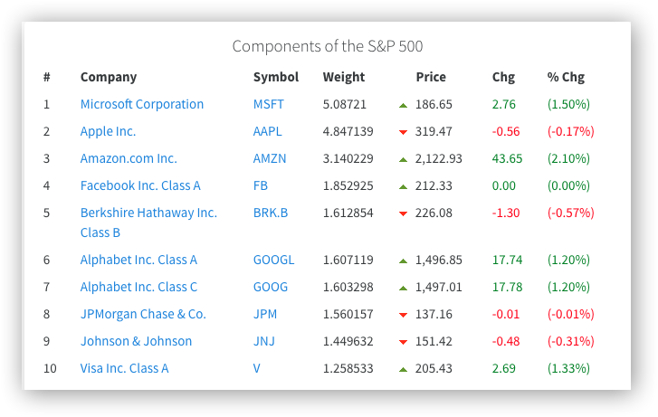
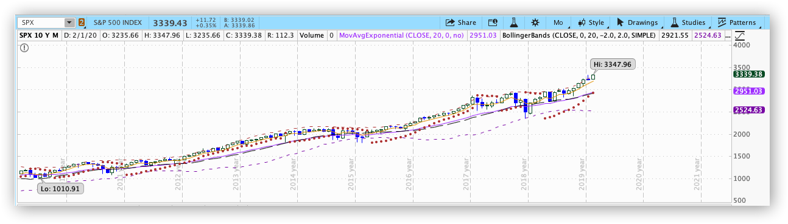

从2020年1月27号到2月4号，Tesla 涨了大概85%，从558块一路涨到887块，真是开Roadster都赶不上TSLA的股价上涨，而在2019年五月的时候，TSLA的股价还下探过185块，因为国际市场的开拓，仅仅不到一年的时间股价就翻了4倍，在此先给偶像Musk跪下。

## S&P 500 为啥长生不衰

但是本文主要不是想来讨论Tesla多么牛逼，而是Tesla的快速拉升后，它的市值已经超过千亿美金，其实它已经接近达到了标普500（S&P 500）的门槛了，我们先来研究一下 S&P 500 的门槛是什么？

> **To qualify for the index, a company must have:**
>
> a market cap of $5.3 billion
> its headquarters in the U.S.
> the value of its market capitalization trade annually
> at least a quarter-million of its shares trade in each of the previous six months
> most of its shares in the public’s hands
> at least half a year since its initial public offering
> Four straight quarters of positive as-reported earnings.

* Tesla 的市值已经达标了
* 总部在美国也达标了
* 过去六个月有至少250,000股可供交易
* 50% 以上的流通股也达标了
* 至少 IPO 后半年也达标了
* 过去四个月实现盈利，这个没有达标，似乎并不是强制要求，而且以它目前的趋势盈利已经大势所趋

S&P 500 是 capitalization-weighted index

>**What Is a Capitalization-Weighted Index?**
>
>A capitalization-weighted index is a type of [market index](https://www.investopedia.com/terms/m/marketindex.asp) with individual components, or securities, weighted according to their total [market capitalization](https://www.investopedia.com/terms/m/marketcapitalization.asp). Market capitalization uses the total market value of a firm's outstanding shares. The calculation multiples outstand shares by the current price of a single share. Outstanding shares are those owned by individual shareholders, institutional block holdings, and company insider holdings.
>
>Origin from : https://www.investopedia.com/terms/c/capitalizationweightedindex.asp

它的 Top 10 Holdings 如下：

你要知道标普500 权重最低的 NWS，它的市值才82亿美元（截止 Fed 11th, 2020)，所以一对比Tesla上千亿市值，加上它的新能源车上的领先优势带来的盈利前景，还不是一家指数前500的公司呢，所以带来的思考就是被编制进制数的公司的轮替将给指数带来长盛不衰的生命，盈利前景偏差的公司退出，发展前景的公司轮替进去，而且可能是远比先前的在指数末尾的公司强大得多的后备军，也难怪巴菲特建议他的家人在他死后也能继续买标普指数。

回看过去十年，SPX 确实也是一路高歌，如果时间再往前推个百年，那更是一部优秀公司的兴衰史，但是唯有指数本身长生不衰

写到这里，大家应该都明白了，逢低 **Long S&P 500** 得多靠谱！！！！

## SPX Future

S&P 500 Index Future，可以用来跟踪在盘前盘后，乘数为1:250， 用美金计价

**Trading hours**

>Open Outcry: Monday - Friday: 9:30 a.m. - 4:15 p.m. Eastern Time (ET)
>
>CME Globex: Sunday - Friday: 6:00 p.m. - 5:00 p.m. ET with a trading halt 9:15 a.m. - 4:30 p.m.
>
>CME Clearport: Sunday - Friday: 6:00 p.m. - 5:00 p.m. ET
>
>Origin from : https://www.cmegroup.com/trading/equity-index/us-index/sandp-500_contract_specifications.html

其实我不建议交易这种期货，但是可以当指标看看

## SPY

跟踪 S&P 500 index 的ETF，流动性极佳，衍生品也丰富，用来做期权交易极佳

> SPY tracks a market-cap-weighted index of US large- and midcap stocks selected by the S&P Committee.
>
> SPY is the best-recognized and oldest ETF and typically tops rankings for largest AUM and greatest trading volume. The fund tracks the massively popular US index, the S&P 500. Few realize that S&P's index committee chooses 500 securities to represent the US large-cap space—not necessarily the 500 largest by market cap, which can lead to some omissions of single names. Still, the index offers outstanding exposure to the US large-cap space. Unlike direct peers IVV and VOO, SPY is a unit investment trust, an older but entirely viable structure. As a UIT, SPY must fully replicate its index (it probably would anyway) and forgo the small risk and reward of securities lending. It also can’t reinvest portfolio dividends between distributions; the resulting cash drag will slightly hurt performance in up markets and help in downtrends. SPY is extremely cheap to hold, but is typically edged out by IVV and VOO in this respect. SPY's phenomenal trading volume makes it the perfect vehicle for tactical traders and mom and pop investors alike.
>
> Origin from : https://www.etf.com/SPY#overview

SPY 在高位的时候，之所以用option call 合适，是因为 risk limited，因为只要美元持续独霸天下，金融危机或者地区冲突不来，s&p 500 大周期就是一路向上的，想低位买入很难

## ES

ES: E-mini S&P 500 Futures Quotes, 可以用来跟踪在盘前盘后, 在CME Globex交易，乘数为1:50，用美元计价

**Trading hours**

> CME Globex: 
> Sunday - Friday 6:00 p.m. - 5:00 p.m. Eastern Time (ET) with trading halt 4:15 p.m. - 4:30 p.m.
>
> Origin from: https://www.cmegroup.com/trading/equity-index/us-index/e-mini-sandp500_contract_specifications.html

其实我不建议交易这种期货，但是可以当指标看看

_To be continued_

## Reference
_S&P 500 Index_
https://en.wikipedia.org/wiki/S%26P_500_Index

_How Are S&P 500 Stocks Chosen?_
https://www.fool.com/investing/2019/02/09/how-are-sp-500-stocks-chosen.aspx