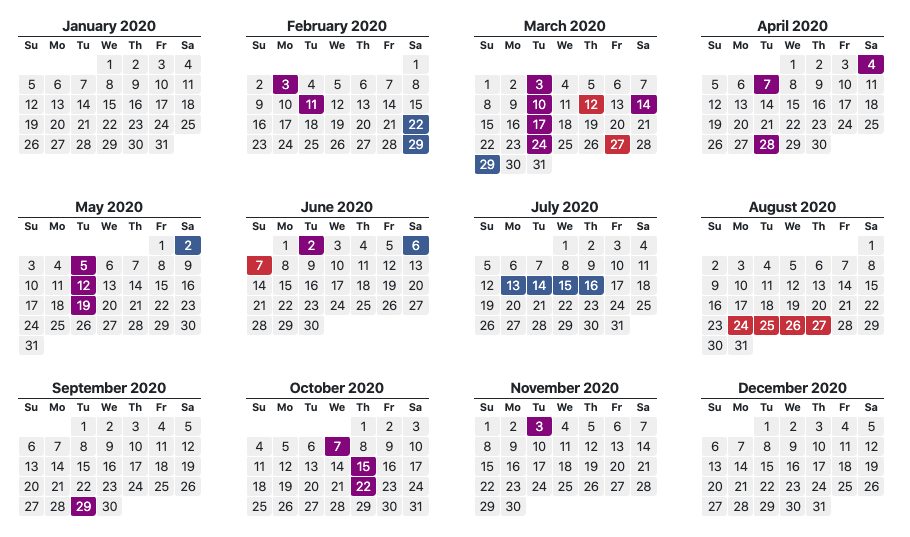

美股其实是需要去管理时间窗口的，尤其是在大选年，所以了解美国候选人的动向和时间节点还是比较重要的，所以不如慢慢随着选举的展开学习一下美国的选择制度，侧重点在于流程上和候选人政策理念对市场的影响上

## United States Presidential Primary Election

> **美国总统初选**是指在[美国总统选举](https://zh.wikipedia.org/wiki/美国总统选举)的候选人提名过程中，各州及领地举办的一系列[初选](https://zh.wikipedia.org/wiki/初選)（primary election）与[党团会议](https://zh.wikipedia.org/wiki/党团会议)（caucus）。
>
> [美国宪法](https://zh.wikipedia.org/wiki/美国宪法)对此并没有任何规定，这是各政党自己逐渐发展出来的一套流程。有些州只举办初选，也有些州只举办党团会议，还有些州两者皆有。每个大选年，各州的初选与党团会议并非同时举行，而是会持续数月，通常于一月下旬或二月上旬开始，于六月中旬结束。各州与当地政府会举行初选，而党团会议则是由各政党自己举行的内部会议。一州的初选或党团会议通常为[间接选举](https://zh.wikipedia.org/wiki/间接选举)，选民并非直接决定总统候选人，而是选出代表参加各党[提名大会](https://zh.wikipedia.org/wiki/美国总统提名大会)。这些代表则会在大会上选出各党总统候选人。
>
> Origin from [https://zh.wikipedia.org/wiki/美国总统初选](https://zh.wikipedia.org/wiki/美国总统初选)

## Caucus

Caucus : 党团会议，“某个政党的地方成员举行会议，推举党内参加代表大会的成员或者指定竞选公职的候选人”。

现在美国有以下的州在总统大选中采用党团会议（Caucus）形式：

* 科罗拉多(Colorado)

* 夏威夷(Hawaii)

* 明尼苏达(Minnesota)

* 北达科他(North Dakota)

* 爱奥华(Iowa)

* 内华达(Nevada)

* 缅因(Maine)

**2020 美国初选 爱奥华州为例**

党团会议和我们一般理解的投票选举不一样，参加的人必须聚集在某个地点。任何人都可以站起来发言支持某位候选人。所以竞选活动是党团会议的一个重要部分，所以在党团会议期间，候选人应该尽量派遣大量人员到各个党团会议地点进行游说。

任何登记为政党成员的选民都可以参加党团会议。比如在第一个举行党团会议的爱奥华州99个县共有1774个党团会议集会地点。这些集会地点可以是教会、学校、社区中心等等。

选举结果如无意外一般一两天就会出来，作为今后的选举风向标，可以提前布局相关的板块，比如医药板块

## Primary

Primary : 党内初选

_现在还没primary，作者困了，以后继续补充_

### The Democratic Nomination for President

| Nominator                               |      | Slogan                                                       |
| --------------------------------------- | ---- | ------------------------------------------------------------ |
| Senator Michael Bennet                  |      | Building Opportunity Together                                |
| Former VP Joe Biden                     | *    | Our Best Days Still Lie Ahead                                |
| Former NY Mayor Mike Bloomberg          |      | * A New Choice for Democrats * Fighting For Our Future  |
| Former South Bend Mayor Pete Buttigieg  |      | * A Fresh Start for America  * Win the Era              |
| Rep. Tulsi Gabbard                      |      | * Lead with Love  * Stand Up with Tulsi                 |
| Sen. Amy Klobuchar                      |      | * Amy for America * Let's Get to Work                   |
| Former Massachusetts Gov. Deval Patrick |      | Deval for All                                                |
| Sen. Bernie Sanders                     | *    | Not Me. Us.                                                  |
| Billionaire Tom Steyer                  |      | * Climate Change Cannot Wait * Actions Speak Louder Than Words |
| Sen. Elizabeth Warren                   | *    | * Persist * Best President Money Can't Buy * Warren Has a Plan For That |
| Businessman Andrew Yang                 |      | * Humanity First * Make America Think Harder (MATH)     |

Rep. for Representative 
Sen. for Senator 

### The Republican Nomination for President

| Nominator    |      | Slogan                                                       |
| ------------ | ---- | ------------------------------------------------------------ |
| Bill Weld    |      | Together We Are Stronger                                     |
| Donald Trump | *    | * Make America Great Again  * Promises Made, Promises Kept |
| Joe Walsh    |      | Be Brave                                                     |

## 2020 Election Calendar

| Date        | State            | Democratic                                                   | Republican                                                   |
| ----------- | ---------------- | ------------------------------------------------------------ | ------------------------------------------------------------ |
| February 3  | Iowa             | [Caucus](https://www.270towin.com/2020-democratic-nomination/iowa-caucus) | [Caucus](https://www.270towin.com/2020-republican-nomination/iowa-caucus) |
| February 11 | New Hampshire    | [Primary](https://www.270towin.com/2020-democratic-nomination/new-hampshire-primary) | [Primary](https://www.270towin.com/2020-republican-nomination/new-hampshire-primary) |
| February 22 | Nevada           | [Caucus](https://www.270towin.com/2020-democratic-nomination/nevada-caucus) |                                                              |
| February 29 | South Carolina   | [Primary](https://www.270towin.com/2020-democratic-nomination/south-carolina-primary) |                                                              |
|             |                  |                                                              |                                                              |
| March 3     | Alabama          | [Primary](https://www.270towin.com/2020-democratic-nomination/alabama-primary) | [Primary](https://www.270towin.com/2020-republican-nomination/alabama-primary) |
|             | American Samoa   | [Caucus](https://www.270towin.com/2020-democratic-nomination/american-samoa-caucus) |                                                              |
|             | Arkansas         | [Primary](https://www.270towin.com/2020-democratic-nomination/arkansas-primary) | [Primary](https://www.270towin.com/2020-republican-nomination/arkansas-primary) |
|             | California       | [Primary](https://www.270towin.com/2020-democratic-nomination/california-primary) | [Primary](https://www.270towin.com/2020-republican-nomination/california-primary) |
|             | Colorado         | [Primary](https://www.270towin.com/2020-democratic-nomination/colorado-primary) | [Primary](https://www.270towin.com/2020-republican-nomination/colorado-primary) |
|             | Democrats Abroad | [Primary](https://www.270towin.com/2020-democratic-nomination/democrats-abroad-primary) |                                                              |
|             | Maine            | [Primary](https://www.270towin.com/2020-democratic-nomination/maine-primary) | [Primary](https://www.270towin.com/2020-republican-nomination/maine-primary) |
|             | Massachusetts    | [Primary](https://www.270towin.com/2020-democratic-nomination/massachusetts-primary) | [Primary](https://www.270towin.com/2020-republican-nomination/massachusetts-primary) |
|             | Minnesota        | [Primary](https://www.270towin.com/2020-democratic-nomination/minnesota-primary) | [Primary](https://www.270towin.com/2020-republican-nomination/minnesota-primary) |
|             | North Carolina   | [Primary](https://www.270towin.com/2020-democratic-nomination/north-carolina-primary) | [Primary](https://www.270towin.com/2020-republican-nomination/north-carolina-primary) |
|             | Oklahoma         | [Primary](https://www.270towin.com/2020-democratic-nomination/oklahoma-primary) | [Primary](https://www.270towin.com/2020-republican-nomination/oklahoma-primary) |
|             | Tennessee        | [Primary](https://www.270towin.com/2020-democratic-nomination/tennessee-primary) | [Primary](https://www.270towin.com/2020-republican-nomination/tennessee-primary) |
|             | Texas            | [Primary](https://www.270towin.com/2020-democratic-nomination/texas-primary) | [Primary](https://www.270towin.com/2020-republican-nomination/texas-primary) |
|             | Utah             | [Primary](https://www.270towin.com/2020-democratic-nomination/utah-primary) | [Primary](https://www.270towin.com/2020-republican-nomination/utah-primary) |
|             | Vermont          | [Primary](https://www.270towin.com/2020-democratic-nomination/vermont-primary) | [Primary](https://www.270towin.com/2020-republican-nomination/vermont-primary) |
|             | Virginia         | [Primary](https://www.270towin.com/2020-democratic-nomination/virginia-primary) |                                                              |
|             |                  |                                                              |                                                              |
| March 10    | Idaho            | [Primary](https://www.270towin.com/2020-democratic-nomination/idaho-primary) | [Primary](https://www.270towin.com/2020-republican-nomination/idaho-primary) |
|             | Michigan         | [Primary](https://www.270towin.com/2020-democratic-nomination/michigan-primary) | [Primary](https://www.270towin.com/2020-republican-nomination/michigan-primary) |
|             | Mississippi      | [Primary](https://www.270towin.com/2020-democratic-nomination/mississippi-primary) | [Primary](https://www.270towin.com/2020-republican-nomination/mississippi-primary) |
|             | Missouri         | [Primary](https://www.270towin.com/2020-democratic-nomination/missouri-primary) | [Primary](https://www.270towin.com/2020-republican-nomination/missouri-primary) |
|             | North Dakota     | [Primary](https://www.270towin.com/2020-democratic-nomination/north-dakota-primary) |                                                              |
|             | Washington       | [Primary](https://www.270towin.com/2020-democratic-nomination/washington-primary) | [Primary](https://www.270towin.com/2020-republican-nomination/washington-primary) |
|             |                  |                                                              |                                                              |
| March 12    | Virgin Islands   |                                                              | [Caucus](https://www.270towin.com/2020-republican-nomination/virgin-islands-caucus) |
|             |                  |                                                              |                                                              |
| March 14    | Guam             |                                                              | [Caucus](https://www.270towin.com/2020-republican-nomination/guam-caucus) |
|             | Northern Mariana | [Caucus](https://www.270towin.com/2020-democratic-nomination/northern-mariana-caucus) |                                                              |
|             | Wyoming          |                                                              | [Convention](https://www.270towin.com/2020-republican-nomination/wyoming-convention) |
|             |                  |                                                              |                                                              |
| March 17    | Arizona          | [Primary](https://www.270towin.com/2020-democratic-nomination/arizona-primary) |                                                              |
|             | Florida          | [Primary](https://www.270towin.com/2020-democratic-nomination/florida-primary) | [Primary](https://www.270towin.com/2020-republican-nomination/florida-primary) |
|             | Illinois         | [Primary](https://www.270towin.com/2020-democratic-nomination/illinois-primary) | [Primary](https://www.270towin.com/2020-republican-nomination/illinois-primary) |
|             | Northern Mariana |                                                              | [Caucus](https://www.270towin.com/2020-republican-nomination/northern-mariana-caucus) |
|             | Ohio             | [Primary](https://www.270towin.com/2020-democratic-nomination/ohio-primary) | [Primary](https://www.270towin.com/2020-republican-nomination/ohio-primary) |
|             |                  |                                                              |                                                              |
| March 24    | American Samoa   |                                                              | [Caucus](https://www.270towin.com/2020-republican-nomination/american-samoa-caucus) |
|             | Georgia          | [Primary](https://www.270towin.com/2020-democratic-nomination/georgia-primary) | [Primary](https://www.270towin.com/2020-republican-nomination/georgia-primary) |
|             |                  |                                                              |                                                              |
| March 27    | North Dakota     |                                                              | [Convention](https://www.270towin.com/2020-republican-nomination/north-dakota-convention) |
|             |                  |                                                              |                                                              |
| March 29    | Puerto Rico      | [Primary](https://www.270towin.com/2020-democratic-nomination/puerto-rico-primary) |
| April 4        | Alaska                                        | [Primary](https://www.270towin.com/2020-democratic-nomination/alaska-primary) |                                                              |
|                | Hawaii                                        | [Primary](https://www.270towin.com/2020-democratic-nomination/hawaii-primary) |                                                              |
|                | Louisiana                                     | [Primary](https://www.270towin.com/2020-democratic-nomination/louisiana-primary) | [Primary](https://www.270towin.com/2020-republican-nomination/louisiana-primary) |
|                | Wyoming                                       | [Caucus](https://www.270towin.com/2020-democratic-nomination/wyoming-caucus) |                                                              |
|                |                                               |                                                              |                                                              |
| April 7        | Wisconsin                                     | [Primary](https://www.270towin.com/2020-democratic-nomination/wisconsin-primary) | [Primary](https://www.270towin.com/2020-republican-nomination/wisconsin-primary) |
|                |                                               |                                                              |                                                              |
| April 28       | Connecticut                                   | [Primary](https://www.270towin.com/2020-democratic-nomination/connecticut-primary) | [Primary](https://www.270towin.com/2020-republican-nomination/connecticut-primary) |
|                | Delaware                                      | [Primary](https://www.270towin.com/2020-democratic-nomination/delaware-primary) | [Primary](https://www.270towin.com/2020-republican-nomination/delaware-primary) |
|                | Maryland                                      | [Primary](https://www.270towin.com/2020-democratic-nomination/maryland-primary) | [Primary](https://www.270towin.com/2020-republican-nomination/maryland-primary) |
|                | New York                                      | [Primary](https://www.270towin.com/2020-democratic-nomination/new-york-primary) | [Primary](https://www.270towin.com/2020-republican-nomination/new-york-primary) |
|                | Pennsylvania                                  | [Primary](https://www.270towin.com/2020-democratic-nomination/pennsylvania-primary) | [Primary](https://www.270towin.com/2020-republican-nomination/pennsylvania-primary) |
|                | Rhode Island                                  | [Primary](https://www.270towin.com/2020-democratic-nomination/rhode-island-primary) | [Primary](https://www.270towin.com/2020-republican-nomination/rhode-island-primary) |
|                |                                               |                                                              |                                                              |
| May 2          | Guam                                          | [Caucus](https://www.270towin.com/2020-democratic-nomination/guam-caucus) |                                                              |
|                | Kansas                                        | [Primary](https://www.270towin.com/2020-democratic-nomination/kansas-primary) |                                                              |
|                |                                               |                                                              |                                                              |
| May 5          | Indiana                                       | [Primary](https://www.270towin.com/2020-democratic-nomination/indiana-primary) | [Primary](https://www.270towin.com/2020-republican-nomination/indiana-primary) |
|                |                                               |                                                              |                                                              |
| May 12         | Nebraska                                      | [Primary](https://www.270towin.com/2020-democratic-nomination/nebraska-primary) | [Primary](https://www.270towin.com/2020-republican-nomination/nebraska-primary) |
|                | West Virginia                                 | [Primary](https://www.270towin.com/2020-democratic-nomination/west-virginia-primary) | [Primary](https://www.270towin.com/2020-republican-nomination/west-virginia-primary) |
|                |                                               |                                                              |                                                              |
| May 19         | Kentucky                                      | [Primary](https://www.270towin.com/2020-democratic-nomination/kentucky-primary) | [Primary](https://www.270towin.com/2020-republican-nomination/kentucky-primary) |
|                | Oregon                                        | [Primary](https://www.270towin.com/2020-democratic-nomination/oregon-primary) | [Primary](https://www.270towin.com/2020-republican-nomination/oregon-primary) |
|                |                                               |                                                              |                                                              |
| June 2         | District of Columbia                          | [Primary](https://www.270towin.com/2020-democratic-nomination/district-of-columbia-primary) | [Primary](https://www.270towin.com/2020-republican-nomination/district-of-columbia-primary) |
|                | Montana                                       | [Primary](https://www.270towin.com/2020-democratic-nomination/montana-primary) | [Primary](https://www.270towin.com/2020-republican-nomination/montana-primary) |
|                | New Jersey                                    | [Primary](https://www.270towin.com/2020-democratic-nomination/new-jersey-primary) | [Primary](https://www.270towin.com/2020-republican-nomination/new-jersey-primary) |
|                | New Mexico                                    | [Primary](https://www.270towin.com/2020-democratic-nomination/new-mexico-primary) | [Primary](https://www.270towin.com/2020-republican-nomination/new-mexico-primary) |
|                | South Dakota                                  | [Primary](https://www.270towin.com/2020-democratic-nomination/south-dakota-primary) | [Primary](https://www.270towin.com/2020-republican-nomination/south-dakota-primary) |
|                |                                               |                                                              |                                                              |
| June 6         | Virgin Islands                                | [Caucus](https://www.270towin.com/2020-democratic-nomination/virgin-islands-caucus) |                                                              |
|                |                                               |                                                              |                                                              |
| June 7         | Puerto Rico                                   |                                                              | [Primary](https://www.270towin.com/2020-republican-nomination/puerto-rico-primary) |
|                |                                               |                                                              |                                                              |
| July 13 - 16   | Democratic Convention (Milwaukee, WI)         |                                                              |                                                              |
| August 24 - 27 | Republican Convention (Charlotte, NC)         |                                                              |                                                              |
| September 29   | First Presidential Debate (South Bend, IN)    |                                                              |                                                              |
| October 7      | Vice Presidential Debate (Salt Lake City, UT) |                                                              |                                                              |
| October 15     | Second Presidential Debate (Ann Arbor, MI)    |                                                              |                                                              |
| October 22     | Third Presidential Debate (Nashville, TN)     |                                                              |                                                              |
| November 3     | 2020 Presidential Election                    |                                                              |                                                              |

## Reference
_美国大选知识：什么是Caucus党团会议_
https://www.voachinese.com/a/article-20120103-iowa-caucus-136608523/792485.html

_美国总统初选_
https://zh.wikipedia.org/wiki/美国总统初选

_2020 Election Calendar_
https://www.270towin.com/2020-election-calendar/