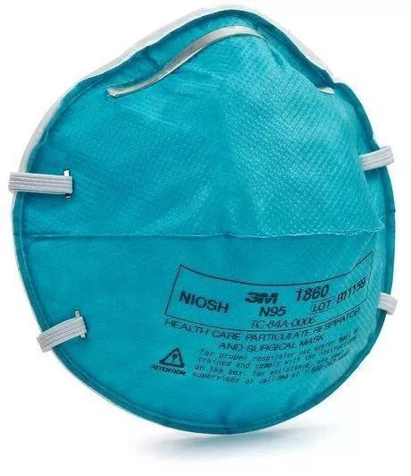
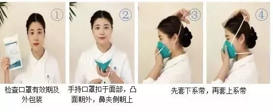
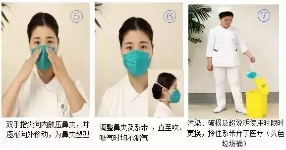
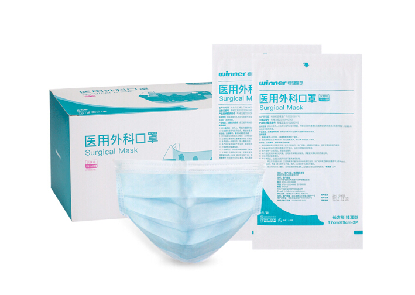
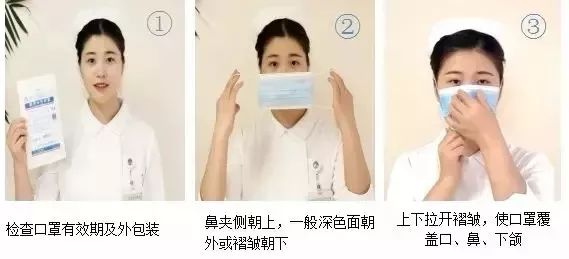
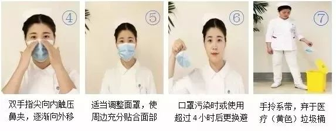
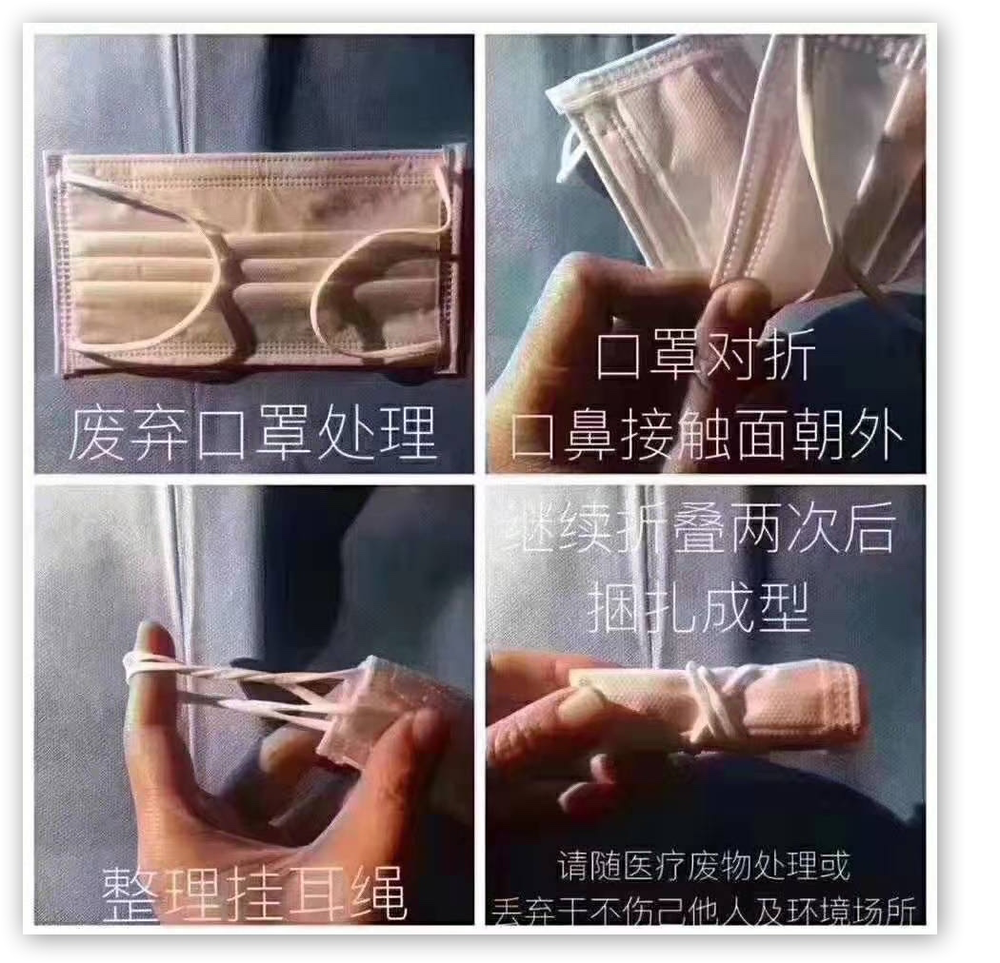

没想过我这个博客会来发布这类内容，但是现在谣言漫天飞，国家正处于危难之际，应该尽自己的一份绵力帮助大家一起度过难关

作为一个普通百姓，我们能做的就是尽量不要引起多余的恐慌，同时尽自己所能帮助前线的医护和患者，捐点钱和物资，相信国家的力量

而自身层面，锻炼身体增强免疫力，勤洗手，按时作息，避免发烧感冒，出门佩戴口罩

| 自身能做的事项                                               |
| ------------------------------------------------------------ |
| 锻炼身体增强免疫力                                           |
| 勤洗手（最好购买洗手液）                                     |
| 按时作息，吃饭                                               |
| 出门佩戴口罩，同时积极说服周围的人，尤其是免疫力低的老人，孩子佩戴 |
| 多喝热水，注意保暖，避免发烧感冒导致免疫力下降               |
| 保持室内通风                                                 |
| 咳嗽和打喷嚏时用衣袖或者手肘部遮挡，用手更易二次传播         |

## 病毒的名称

病毒已被世界卫生组织（WHO）确认并命名为2019-nCoV ( 2019 - novel coronavirus )，所以不是很多谣言里面说的SARI或者什么其他的

## 病毒的潜伏期

现阶段已经证实即便感染了病毒也不一定会发烧, 所以体温测试不是绝对标准

根据各方的资料总结，病毒的潜伏期大概在14天，平均是在7天，所以官方建议一般从武汉回来的同时最好先自我隔离14天或者住院检查

## 病毒的传播方式

从各方的公布的信息源来看，可以确认的传播方式主要还是两种：

* 接触传播
* 飞沫传播（这是戴口罩防护的重点）
* 空气传播（待定）

  

## 口罩的选购

钟南在新闻发布会上说 **N95型口罩** 和 **医用外科口罩** 可以适当防治病毒的传播，N95 是防护级别最高的医用防护口罩，而医用外科口罩是手术室等有创操作环境常用的

### N95 型口罩（N95 Respirator）

N95型口罩是NIOSH（*美国国家职业安全卫生研究所*），National Institute for Occupational Safety and Health）*认证的9种颗粒物防护口罩中的一种。“N”表示不耐油（not resistant to oil）。在这个场景最大的作用是用来防飞沫传播

“95”表示暴露在规定数量的专用试验粒子下，口罩内的粒子浓度要比口罩外粒子浓度低95%以上。其中95%这一数值不是平均值，而是最小值。防护等级为N95级表示在NIOSH标准规定的检测条件下，口罩滤料对非油性颗粒物*（如粉尘、酸雾、漆雾、微生物等）*的过滤效率达到95%。

普通N95口罩有两种，带呼吸阀的和不带呼吸阀的。呼吸阀被认为可能会减小对病毒的防护力度，而不带呼吸阀则透气性较差，呼吸起来比较费力，不宜长时间佩戴。大家在购买时，可根据实际情况选择。

**佩戴方式**

### 医用外科口罩 （Surgical Mask）

医用外科口罩是手术室等有体液、血液飞溅风险环境常用的医用口罩，可阻隔血液、体液穿过口罩污染佩戴者，同时对细菌的过滤效率应不小于95%，但对颗粒的过滤效率有限，且多为长方形设计。

购买时，大家一定要注意认准有"**医用外科口罩**"字样或者标明执行标准的口罩。医用外科口罩的最新执行标准为2011年12月31日发布、2013年6页1日实施的中华人民共和国医药行业标准《医用外科口罩技术要求》**YY-0469-2011**。

**佩戴方式**

### KN95型口罩

简单的说，KN95是国内标准，N95是国外的一种标准。两者的防护效果是一样的

KN95是中国国家标准GB2626-2006对防颗粒物口罩的分类，KN类的口罩适用于过滤非油性颗粒物，比如：粉尘、酸雾、漆雾、微生物等。KP类口罩适合过滤非油性颗粒物和油性颗粒物。油性颗粒物比如：油烟、油雾等。2009年8月1日开始执行的国标GB2626-2006(《呼吸防护用品自吸过滤式防颗粒物呼吸器》)将防尘口罩分为三个等级：KN90，KN95，KN100。过滤效率分别为：90%、95%、99.97%

### 口罩废弃

口罩用后即弃，避免留存交叉感染

未来一段时间，大量沾满唾液、细菌甚至病毒的一次性口罩将会出现在各个城市的垃圾桶，建议大家不要随意丢弃，自己拿开水烫一下再扔，或者定点焚烧。不要让本应该保护我们健康的口罩成为新的病毒传播物。

武汉政府鼓励市民将废弃口罩消毒（喷洒75%酒精、84消毒水），进行简易破损（扯烂或剪碎）后投放至专用容器内，以防不法分子回收贩卖。

## 灾情数据统计

_新型冠状病毒 - 疫情实时追踪 - 腾讯新闻_
https://news.qq.com/zt2020/page/feiyan.htm

## 辟谣

* 板蓝根无效

* 熏醋无效

* 喝酒无效，酒精擦拭手有用

* 吸烟不能抵抗病毒

* VC泡腾片不能增强抵抗力，不能抗病毒

  

_后续持续更新..._

## Reference
_什么样的口罩才能预防新型冠状病毒_  
http://www.xhby.net/index/202001/t20200121_6482735.shtml

_2019-conv on CDC_  
https://www.cdc.gov/coronavirus/2019-ncov/index.html

_武汉市下发规范废弃口罩分类处置紧急通知_. 
http://hb.people.com.cn/n2/2020/0124/c194063-33743303.html

_2019-conv in lancet_
https://www.thelancet.com/coronavirus