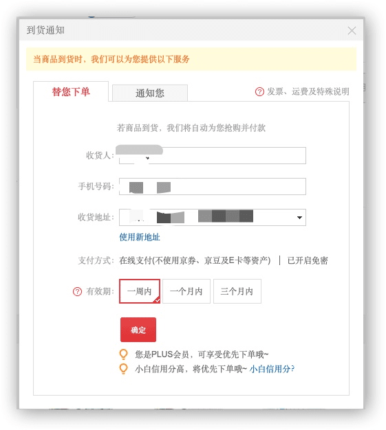

没想过我这个博客会来发布这类内容，但是现在谣言漫天飞，国家正处于危难之际，应该尽自己的一份绵力帮助大家一起度过难关

作为一个普通百姓，我们能做的就是尽量不要引起多余的恐慌，同时尽自己所能帮助前线的医护和患者，捐点钱和物资，相信国家的力量

而自身层面，增强免疫力和搞好环境卫生是重中之重

| 自身能做的事项                                               |
| ------------------------------------------------------------ |
| 锻炼身体增强免疫力                                           |
| 勤洗手（最好购买洗手液）                                     |
| 按时作息，吃饭                                               |
| 出门佩戴口罩，同时积极说服周围的人，尤其是免疫力低的老人，孩子佩戴 |
| 多喝热水，注意保暖，避免发烧感冒导致免疫力下降               |
| 保持室内通风                                                 |
| 咳嗽和打喷嚏时用衣袖或者手肘部遮挡，用手更易二次传播         |
| 烹饪时彻底煮熟肉类和蛋类                                     |
| 跟人接触交谈时保持安全距离，1.5～2米                         |
| 在无保护时避免接触野生动物和家禽家畜                         |
| 禁食野生动物                                                 |
| 按电梯的按钮，用纸巾按，出门常备纸巾                         |

## 病毒的名称

病毒已被世界卫生组织（WHO）确认并命名为2019-nCoV ( 2019 - novel coronavirus )，所以不是很多谣言里面说的SARI或者什么其他的

## 病毒的潜伏期

现阶段已经证实即便感染了病毒也不一定会发烧, 所以体温测试不是绝对标准

根据各方的资料总结，病毒的潜伏期大概在14天，平均是在7天，所以官方建议一般从武汉回来的人最好先自我隔离14天或者住院检查

## 病毒的传播方式

从各方的公布的信息源来看，可以确认的传播方式主要还是三种：

* 接触传播，飞沫沉积在物品表面，接触污染手后，再接触口腔、鼻腔、眼睛等粘膜，导致感染

* 近距离飞沫传播（这是戴口罩防护的重点）

* 气溶胶传播，飞沫混合在空气中，形成气溶胶，吸入后导致感染

* 粪-口传播（Fecal–oral route）（待定）

  

## 口罩的选购

钟南在新闻发布会上说 **N95型口罩** 和 **医用外科口罩** 可以适当防治病毒的传播，N95 是防护级别最高的医用防护口罩，而医用外科口罩是手术室等有创操作环境常用的

### 医用外科口罩 （Surgical Mask）

医用外科口罩是手术室等有体液、血液飞溅风险环境常用的医用口罩，可阻隔血液、体液穿过口罩污染佩戴者，同时对细菌的过滤效率应不小于95%，但对颗粒的过滤效率有限，且多为长方形设计。

购买时，大家一定要注意认准有"**医用外科口罩**"字样或者标明执行标准的口罩。医用外科口罩的最新执行标准为2011年12月31日发布、2013年6页1日实施的中华人民共和国医药行业标准《医用外科口罩技术要求》**YY-0469-2011**。

**佩戴方式**

### N95 型口罩（N95 Respirator）

N95型口罩是NIOSH（*美国国家职业安全卫生研究所*），National Institute for Occupational Safety and Health）*认证的9种颗粒物防护口罩中的一种。“N”表示不耐油（not resistant to oil）。在这个场景最大的作用是用来防飞沫传播

“95”表示暴露在规定数量的专用试验粒子下，口罩内的粒子浓度要比口罩外粒子浓度低95%以上。其中95%这一数值不是平均值，而是最小值。防护等级为N95级表示在NIOSH标准规定的检测条件下，口罩滤料对非油性颗粒物*（如粉尘、酸雾、漆雾、微生物等）*的过滤效率达到95%。

普通N95口罩有两种，带呼吸阀的和不带呼吸阀的。呼吸阀被认为可能会减小对病毒的防护力度，而不带呼吸阀则透气性较差，呼吸起来比较费力，不宜长时间佩戴。大家在购买时，可根据实际情况选择。

**佩戴方式**

### KN95型口罩

简单的说，KN95是国内标准，N95是国外的一种标准。两者的防护效果是一样的

KN95是中国国家标准GB2626-2006对防颗粒物口罩的分类，KN类的口罩适用于过滤非油性颗粒物，比如：粉尘、酸雾、漆雾、微生物等。KP类口罩适合过滤非油性颗粒物和油性颗粒物。油性颗粒物比如：油烟、油雾等。2009年8月1日开始执行的国标GB2626-2006(《呼吸防护用品自吸过滤式防颗粒物呼吸器》)将防尘口罩分为三个等级：KN90，KN95，KN100。过滤效率分别为：90%、95%、99.97%

### 口罩废弃

口罩用后即弃（一般四个小时为准，或被水汽浸湿失去防护效果时也需要更换），避免留存交叉感染

未来一段时间，大量沾满唾液、细菌甚至病毒的一次性口罩将会出现在各个城市的垃圾桶，建议大家不要随意丢弃，自己拿开水烫一下再扔，或者定点焚烧。不要让本应该保护我们健康的口罩成为新的病毒传播物。

武汉政府鼓励市民将废弃口罩消毒（喷洒75%酒精、84消毒水），进行简易破损（扯烂或剪碎）后投放至专用容器内，以防不法分子回收贩卖。

## 有关货源短缺

据我所知短时间全球大部分地区口罩都是缺货的，人口基数大需求陡增，每个人备用一百个都是巨量的，而且全球其他地方的中国人都在采购和掉配物资回国，所以短时间内缺货可以理解，政府已经介入调配

现在市面上的口罩都是限购的，一人一次一盒，而京东上有代下单的功能可以帮我们非人工自动购买没货的产品（此处非商业宣传，而是我自己也在用），点击 **到货通知**

## 灾情数据统计

_新型冠状病毒 - 疫情实时追踪 - 腾讯新闻_
https://news.qq.com/zt2020/page/feiyan.htm

_新型冠状病毒感染的肺炎疫情最新情况公告-卫健委_
http://www.nhc.gov.cn/xcs/yqfkdt/gzbd_index.shtml

## 辟谣

* 板蓝根无效

* 熏醋无效

* 喝酒无效，消毒皮肤可使用75%医用酒精

* 吸烟不能抵抗病毒

* VC泡腾片不能增强抵抗力，不能抗病毒

  

## 有关医用口罩捐赠的标准

从一些新闻反馈上收到大部分的捐赠物资其实不符合医院的使用标准，并且处理这些物品也给医院造成困扰，所以需要补充一下 **武汉大学中南医院** 目前急需医疗物资标准为例：

**医用防护口罩：** 

国内标准：符合中国GB19083-2010标准，代表产品：3M的9132和1860，稳健医疗的医用防护口罩等
海外标准：

美国NIOSH认证，N95；
欧标FFP2或FFP3不带呼吸阀，代表产品3M 9322+；
欧盟：EN149

 

**外科口罩：** 

国内标准：符合中国YY0469-2011标准；代表产品：稳健医疗的医用外科口罩；新乡华西卫材医用外科口罩
海外标准：ASTM F2100-Ⅱ标准，level2或level3

 

**防护服：** 

国内标准：符合中国GB19083-2009标准
海外标准：同等参考美国ASTM F1671-97A;
欧标EN14126相关防血液以及生化细菌穿透实验

## 有关冠状病毒的更多科普

来自李永乐老师的有关冠状病毒的科普视频（YouTube)，比较长，有兴趣可以看看

<iframe width="560" height="315" src="https://www.youtube-nocookie.com/embed/E46_veB0DPU" frameborder="0" allow="accelerometer; autoplay; encrypted-media; gyroscope; picture-in-picture" allowfullscreen></iframe>

后续持续更新..._

## Reference
_什么样的口罩才能预防新型冠状病毒_  
http://www.xhby.net/index/202001/t20200121_6482735.shtml

_2019-conv on CDC_  
https://www.cdc.gov/coronavirus/2019-ncov/index.html

_武汉市下发规范废弃口罩分类处置紧急通知_. 
http://hb.people.com.cn/n2/2020/0124/c194063-33743303.html

_2019-conv in lancet_
https://www.thelancet.com/coronavirus

_曾鉴定出非典源头的石正丽团队发表研究，新型冠状病毒受体与非典病毒相同，还有哪些关键信息_  
https://www.zhihu.com/question/367655939/answer/983850446