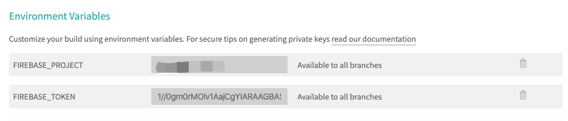

Firebase Hosting 提供 1GB 的免费托管，同时部署在高质量的 Goolge Cloud 上的效果非常好，普通 Blog 都够用，以后需求超了也可以弹性调节 ... 
https://firebase.google.com/pricing


| 类型 | 套件 |
| --- | --- |
| Continuous Integration | Travis CI |
| BaaS | Firebase Hosting |
| Website | Hexo |

## Google Proxy
欲论Google，代理先行，建议使用简单粗暴的方式直接上 Proxifier, 代理 `node` 这个程序的通信代理到你本地的HTTPS 代理上就行了   
我从 log 里面看到在操作的过程中其实node会去request `www.googleapis.com:443`，所以你也可以单独代理这个地址还有 Google 全家桶的地址测试一下

## Firebase Init
首先安装Firebase CLI   
```bash
$npm install -g firebase-tools
```

登录firebase，此处开始会弹出一个网页，需要用代理登陆 Google 账号并授权  
```bash
$firebase login
```
切换到你的Hexo项目的根目录，初始化firebase配置，选择Hosting  
```bash
$firebase init
```
Firebase会生成一个firebase.json并进行配置hexo项目存放静态文件的public目录     
```json
{
  "hosting": {
    "public": "public",
    "ignore": [
      "firebase.json",
      "**/.*",
      "**/node_modules/**"
    ]
  }
}
```
部署到firebase成功后它会给到你访问的地址  
```bash
$firebase deploy
```


## Travis CI Integration

到 https://travis-ci.org/ 初始化账号 用github账号直接登陆，并在Hexo项目的根目录新建一个.travis.yml，内容参考如下：

```yaml
language: node_js
node_js:
- node
branches:
  only:
  - hexo
before_install:
- npm install hexo-cli -g
- git config --global push.default matching
- git config --global user.name "your name"
- git config --global user.email "your email"
- sed -i'' "/^ *repo/s~github\.com~${GITHUB_TOKEN}@github.com~" _config.yml
install:
- npm install
script:
- hexo clean
- hexo d -g
cache:
  directories:
  - node_modules
env:
  global:
  - secure: [Encrypted GITHUB_TOKEN]
deploy:
  provider: firebase
  token:
    secure: [Encrypted firebase token]
  project: hexo-blog
  skip_cleanup: true
  on:
    all_branches: true
    # branches: master
```


### Encrypt Github Token and Firebase CLI Token

因为其实你的 Github 已经对 Travis 进行授权，所以如果用 github public key 对字符串进行加密，Travis其实可以用 private key 对密文进行解密，但是因为其他人没有这个调用 private key 的权限，所以即便你在 .travis.yml 里面的密文放在 github 上让人看到也是安全的。


**Github**  
到 https://github.com/settings/tokens 申请一个 Github access token，密文只会出现一次需要保存起来，授权上全选Repo就行了

加密并直接更新进 .travis.yml 的环境变量, GITHUB_TOKEN为引用的Key  

```bash
$travis encrypt -r [github user]/[github page project] "GITHUB_TOKEN=[github access token]" --add
```


**Firebase Token**
运行一下代码获取firebase免交互的Login Token

```bash
$firebase login:ci
```

利用github的 public key 对 firebase token 进行加密,并添加到`.travis.yml`的 deploy.token.secure  

```bash
$travis encrypt -r [github user]/[github page project] [firebase token] --add deploy.token
```

最终在 CI Pipleline 运行脚本的前需要把你在本地进行 Firebase login 后的 Session 进行 `firebase logout`


_因为的测试次数有限，第一次是成功了，但是 Firebase 第一次的加密使用是成功的，第二次却失败了（以后继续测试我还会像这次一样回来修改增补文章），然后我使用直接在 travis-ci.org/[github user]/[github user repo]/settings设置环境变量的方法，就是不暴露在 Github 的`.travis.yml`里面感觉似乎更安全_



这种方式跟直接加在`.travis.yml`的区别就是在 run script 的时候环境变量的变量来源不同

- Setting environment variables from repository settings
- Setting environment variables from .travis.yml

```bash
#Snippet of running script
Setting environment variables from repository settings
$ export FIREBASE_TOKEN= ****
$ export FIREBASE_PROJECT=**

Setting environment variables from .travis.yml
$ export GITHUB_TOKEN=[secure]
```


以上的设置 travis-ci.org 的，而另外会有一个关联的企业服务的网站叫travis-ci.com，它的加密方式需要再参数上加`--pro`，加密前需用pro的账号登陆

```bash
travis login --pro
```

其他命令雷同，只是在参数上加上 `--pro`即可

Travis-ci.org 只能显示github 上 public 的项目，而Travis-ci.com 可以看到 private 的项目，有些收费计划那样， 不过我还是选择了 org, 暂时够用就好了


## Reference

_travis ci for firebase_
https://docs.travis-ci.com/user/deployment-v2/providers/firebase/
_guideline_
https://blog.erguotou.me/hexo-on-firebase.html
_travis with js_
https://github.com/dwyl/learn-travis
_Travis-CI加密变量_
https://blog.ahao.moe/posts/Travis_CI_Encrypting_keys.html
_Travis CI_
https://docs.travis-ci.com/user/environment-variables/