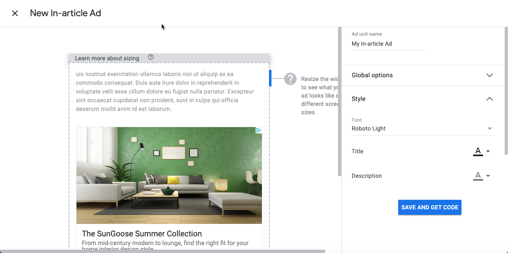

_This is the guideline to setup the Google Analuytics and Adsense in Hexo with Theme-NexT_  

| Component       | version |
| --------------- | ------- |
| Hexo            | 4.1.1   |
| hexo-theme-next | 7.6.0   |


## Google Analytics
_Google Analysis_  
https://analytics.google.com/analytics/web/#/  

**Setup**  
1. Register and activate the account of google analytics
2. Steps forward as the guideline of GA, copy and paste the scirpt to hexo(look into the following steps)  
3. Uncomment the reference of `header.swig` in `_config.yml` of the theme, hexo-next  
    ```
    header: source/_data/header.swig
    ```
4. Create the {HEXO_ROOT}/source/_data/post-body-end.swig
    ```
    <!-- Google AdSense start -->

    <script data-ad-client="ca-pub-key" async src="https://pagead2.googlesyndication.com/pagead/js/adsbygoogle.js"></script>

    <!-- Google AdSense end -->
    ```

## Google Adsense
_Google adsense_  
https://www.google.com/adsense 

**Setup**  
1. Register and activate the account of google adsense
2. Navigate to the Ads by units(recommended), customize your style of ads and copy and paste the scirpt to hexo(look into the following steps)  

3. Uncomment the reference of `post-body-end.swig` in `_config.yml` of the theme, hexo-next  
4. Create the {HEXO_ROOT}/source/_data/post-body-end.swig
    ```

    {# google adsense body #}
    <script async src="https://pagead2.googlesyndication.com/pagead/js/adsbygoogle.js"></script>
    <ins class="adsbygoogle"
         style="display:block; text-align:center;"
         data-ad-layout="in-article"
         data-ad-format="fluid"
         data-ad-client="ca-pub-6391042540548664"
         data-ad-slot="7494260686"></ins>
    <script>
         (adsbygoogle = window.adsbygoogle || []).push({});
    </script>

    {# google adsense end #}

    ```
 
## Google search Console
You can submit the sitemap.xml and RSS feed as the source of your site map  
**to be continues**  


## Baidu Tongji
**to be continues**  


## Reference
_创建和提交站点地图_  
https://support.google.com/webmasters/answer/183668?hl=zh-Hans
_Google adsense_  
https://www.google.com/adsense  
_Google Analysis_  
https://analytics.google.com/analytics/web/#/
_谷歌广告类型的说明_  
https://darylliu.github.io/archives/6a1f6623.html  


  