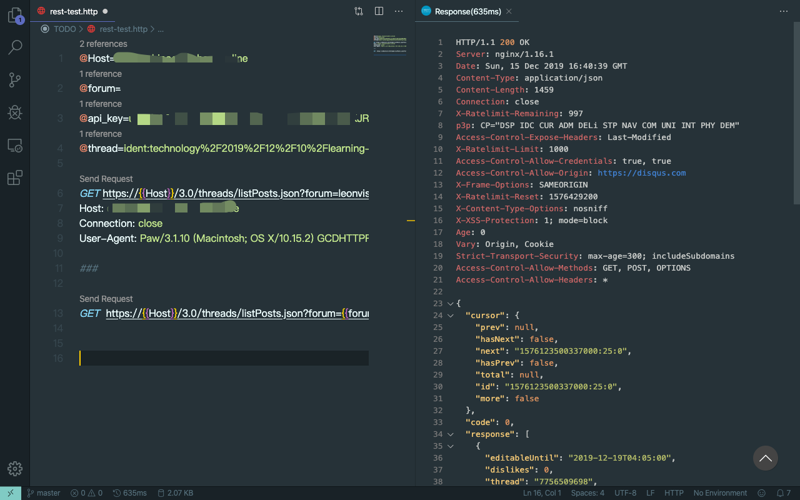

Hexo is flexible blog system and Next comes with bundle of extensions to make it easier to use hexo blog.


| Component       | Version |
| --------------- | ------- |
| hexo            | 4.2     |
| hexo-theme-next | 7.7     |


# Hexo Init

$ hexo init # Initial the project  
$ npm install # download the independencies  
$ tree ./ -L 1 #  Just review the file tree  
$ hexo g # Generate the html  
$ hexo s # Start the server  
$ code _config.yml

```yaml
deploy:
    type: git
    repo:  # your github repo
    branch: master
```


# Custom Domain Name

add a new file "CNAME" under the folder /public/
add your domain name as the content

    $ echo "domain name" > ./public/CNAME


# Custom Theme

$ git clone https://github.com/theme-next/hexo-theme-next.git themes/theme_next
change the content in the _config.yml

    theme: theme_next

$ hexo clean # clean public/

Link to the homepage : [https://theme-next.org](https://theme-next.org)


# Google Adsense

* Add a file source/_data/header.swig.
* past the <script>..</script> from google adsense on it
* uncomment the line in themes/theme_next/_config.yml
```
# Define custom file paths.
# Create your custom files in site directory `source/_data` and uncomment needed files below.
custom_file_path:
    #head: source/_data/head.swig
    header: source/_data/header.swig
    #sidebar: source/_data/sidebar.swig
```

more detail in [google-analytics-and-adsense-in-hexo](https://i.leonvision.online/technology/2019/12/16/google-analytics-and-adsense-in-hexo/)   


# Comment System

## Disqus
Disqus can allow the anonymous, but it can not use in China.

[Add Comments Section to Your Hexo Blog](https://qiuyiwu.github.io/2019/01/25/Hexo-Comment/)

DisqusJS can help us to go through the whole world  
https://theme-next.org/docs/third-party-services/comments

## Valine

To be continue

https://juejin.im/post/5d790e706fb9a06af8250665


# Hexo Editor - Typora
Typora is a what you see is what you get system.

_Here is my another tutorial_
https://leonvision.online/technology/wysiwyg-markdown-editor-typora/

or use evernote for China to edit the markdown


# Global Avatar

Add the url into the Avatar section in the _config
Refer to the link as below:
https://en.gravatar.com/emails/


# Search

**Enable the local serach in the _config.yml of theme-next**

    local_search:
      enable: true


# Google Analysis

Enable in {theme/to/next}/_config.yml

    google_analytics:
      tracking_id: UA-number
      localhost_ignored: false

and also using the google tag manager to integrate the google analysis is better choice.


# RSS Feed

**Installation**

    npm install hexo-generator-feed --save

**Configuration**
In {ROOT}/themes/theme_next/_config.yml

    social:
      RSS: /atom.xml || rss


​      
# Categories & Tags

Only posts support the use of categories and tags. Categories apply to posts in order, resulting in a hierarchy of classifications and sub-classifications. Tags are all defined on the same hierarchical level so the order in which they appear is not important.

**Example**

    categories:
    - Sports
    - Baseball
    tags:
    - Injury
    - Fight
    - Shocking

https://hexo.io/docs/front-matter.html

**Configuration**

    # External url should start with http:// or https://
    menu:
      home: / || home
      about: /about/ || user
      tags: /tags/ || tags
      categories: /categories/ || th
      archives: /archives/ || archive


# Enhance Image Reference

**Installation**  
    $ npm i --save hexo-asset-link

**Markdown Syntax**
```Markdown


```
**Reference**  
_Image to Hexo_  
https://liolok.github.io/zh-CN/How-to-Add-Image-to-Hexo-Blog-Post/


# Mermaid Surpport for Diagram

Hexo Next already supported the mermaid nested.
https://github.com/theme-next/theme-next.org/blob/source/source/docs/tag-plugins/mermaid.md

Next use its own tag system to convert the diagram. so we need to fixed it aligning the common markdown practice.

`npm install hexo-filter-mermaid-diagrams save`

This filter will convert the indicator ````mermaid`  to `<pre class="mermaid">`, and then mermaid.js will filter  the elememet and redender them.


# Force to Refresh the Browser
Presss `Shift + Command + R` to force to refresh the browser(Chrome) to test the result in Mac 

Presss `Option + Command + R` to force to refresh the browser(Safari) to test the result in Mac 


# Reference:
_Hexo backup_
https://blog.itswincer.com/posts/7efd2818/

_Add google adsense_
https://juejin.im/post/5c95d230e51d45124e35cef6

_Third party for theme next_
https://theme-next.iissnan.com/third-party-services.html

_Wirit the post_
https://hexo.io/zh-cn/docs/writing.html

_Front-matter_
https://hexo.io/docs/front-matter.html

_asset folder_
https://hexo.io/docs/asset-folders