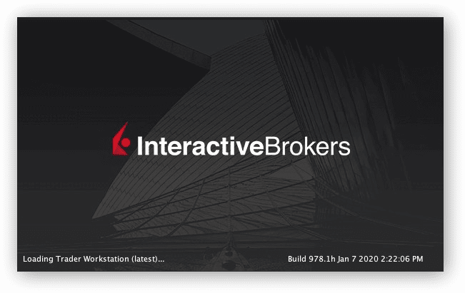
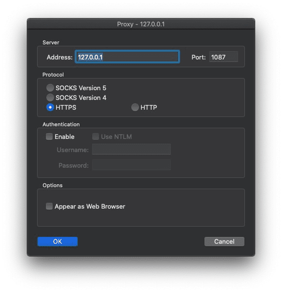

IB（Interactive Broker) 的投资品种，融资成本，交易费率，出入金成本，资金账户管理综合起来都是比较合理的




但是在中国区用IB有的时候会面临会网络不稳定的困难，比如启动后的版本升级很卡，这块稍微研究了一下感觉可以适当写个 半文 来帮助小伙伴，之所以说是半文是因为有另一半没讲的是必须 `你懂的`


**Preparation**

* 自备通用加速代理
* Localhost 监听 一个 https  端口，自己定义，此文是 port: 1087

如果你看到这里已经感觉已经办不来了，那就可以直接关闭此文去玩游戏了  


## TWS Proxy

## Principle
因为我用Mac，所以我优先介绍 Mac 上的 TWS 的成功实践
在 Mac 上 IB TWS 是用 Java 写的 Application,  打包在 JavaApplicationStub 里面

>Intruduction to Java Application Stub
>
>The Java Launching stub file is located inside of your application bundle in the subdirectory "Contents/MacOS/". The default name for this file is "JavaApplicationStub". It is used by the Mac OS X system read the applications plist and then launch the Java VM with the appropriate properties such as the classpath and main class name.
>
>http://informagen.com/JarBundler/StubFile.html
>

> 大概理解就行不用深究，所以思路就是让这个 JavaApplicationStub 通过我们前面准备好的代理把请求通过 1087 端口转发出去


## TWS Proxy
使用 Proxifier 进行代理
https://www.proxifier.com/download/

**Step 1**

在 Proxifier 里面增加一个 Proxy：127.0.0.1:1087, 1087对应你本地的代理设置，可自行更改



**Step 2**

增加一条 Rule for TWS，制定 Applications -> JavaApplicationStub 的请求转发到 Proxy HTTPS 127.0.0.1:1087 就搞定了


接下来就可以通过代理使用 TWS 了，登陆的Log可以看下面的`Proxifier TWS Log`，你可以看到 TWS 通过哪个端口去访问了哪个地址，这个的作用是如果你不想通过 Proxifier 去代理，那就手动把出现的所有访问网站全给代理了就行了

而对于非Mac系统，例如windows，可以先用 Proxifier 全局代理后看看具体是哪个 TWS instance 去访问网络就把Application替换成那个就好了


## Proxifier TWS Log
```

[01.17 12:31:48] 
[01.17 12:31:48] 		Welcome to Proxifier v2.26 
[01.17 12:31:48] 
[01.17 12:31:48] Profile "Trading Profile" loaded.
[01.17 12:33:38] JavaApplicationStub - download2.interactivebrokers.com:443 open through proxy 127.0.0.1:1087 HTTPS
[01.17 12:33:53] JavaApplicationStub - download2.interactivebrokers.com:443 close, 677 bytes sent, 118775 bytes (115 KB) received, lifetime 00:15
[01.17 12:33:56] JavaApplicationStub - download2.interactivebrokers.com:443 open through proxy 127.0.0.1:1087 HTTPS
[01.17 12:34:02] JavaApplicationStub - hdc1.ibllc.com:4000 open through proxy 127.0.0.1:1087 HTTPS
[01.17 12:34:07] JavaApplicationStub - hdc1.ibllc.com:4000 close, 19 bytes sent, 1091 bytes (1.06 KB) received, lifetime 00:05
[01.17 12:34:11] JavaApplicationStub - download2.interactivebrokers.com:443 close, 895 bytes sent, 819 bytes received, lifetime 00:15
[01.17 12:36:52] JavaApplicationStub - hdc1.ibllc.com:4001 open through proxy 127.0.0.1:1087 HTTPS
[01.17 12:37:21] JavaApplicationStub - download2.interactivebrokers.com:443 open through proxy 127.0.0.1:1087 HTTPS
[01.17 12:37:27] JavaApplicationStub - download2.interactivebrokers.com:443 close, 634 bytes sent, 18273 bytes (17.8 KB) received, lifetime 00:06
[01.17 12:37:27] JavaApplicationStub - www.interactivebrokers.com.hk:443 open through proxy 127.0.0.1:1087 HTTPS
[01.17 12:37:37] JavaApplicationStub - s3.amazonaws.com:443 open through proxy 127.0.0.1:1087 HTTPS
[01.17 12:37:41] JavaApplicationStub - www.interactivebrokers.com.hk:443 close, 621 bytes sent, 4618 bytes (4.50 KB) received, lifetime 00:14
[01.17 12:37:45] JavaApplicationStub - download2.interactivebrokers.com:443 open through proxy 127.0.0.1:1087 HTTPS
[01.17 12:37:49] JavaApplicationStub - download2.interactivebrokers.com:443 close, 634 bytes sent, 20239 bytes (19.7 KB) received, lifetime 00:04
[01.17 12:37:49] JavaApplicationStub - www.interactivebrokers.com.hk:443 open through proxy 127.0.0.1:1087 HTTPS
[01.17 12:37:54] JavaApplicationStub - s3.amazonaws.com:443 close, 736 bytes sent, 220267 bytes (215 KB) received, lifetime 00:17
[01.17 12:38:01] JavaApplicationStub - www.interactivebrokers.com.hk:443 close, 547 bytes sent, 1149 bytes (1.12 KB) received, lifetime 00:12
[01.17 12:38:14] JavaApplicationStub - hdc1.ibllc.com:4000 open through proxy 127.0.0.1:1087 HTTPS
[01.17 12:38:16] JavaApplicationStub - hdc1.ibllc.com:4000 open through proxy 127.0.0.1:1087 HTTPS
[01.17 12:38:24] JavaApplicationStub - hdc1.ibllc.com:4000 open through proxy 127.0.0.1:1087 HTTPS
[01.17 12:38:45] JavaApplicationStub - ndcdyn.interactivebrokers.com:443 open through proxy 127.0.0.1:1087 HTTPS
[01.17 12:38:54] JavaApplicationStub - risk.interactivebrokers.com:443 open through proxy 127.0.0.1:1087 HTTPS
[01.17 12:38:57] JavaApplicationStub - ndc1.ibllc.com:4000 open through proxy 127.0.0.1:1087 HTTPS
[01.17 12:38:57] JavaApplicationStub - ndc1.ibllc.com:4000 open through proxy 127.0.0.1:1087 HTTPS
[01.17 12:38:57] JavaApplicationStub - hdc1.ibllc.com:4000 open through proxy 127.0.0.1:1087 HTTPS
[01.17 12:38:58] JavaApplicationStub - zdc1.ibllc.com:4000 open through proxy 127.0.0.1:1087 HTTPS
[01.17 12:38:58] JavaApplicationStub - ndc1.ibllc.com:4000 open through proxy 127.0.0.1:1087 HTTPS
[01.17 12:38:58] JavaApplicationStub - zdc1.ibllc.com:4000 open through proxy 127.0.0.1:1087 HTTPS
[01.17 12:38:58] JavaApplicationStub - ndc1.ibllc.com:4000 open through proxy 127.0.0.1:1087 HTTPS
[01.17 12:38:58] JavaApplicationStub - ndc1.ibllc.com:4000 open through proxy 127.0.0.1:1087 HTTPS
[01.17 12:38:59] JavaApplicationStub - ndcdyn.interactivebrokers.com:443 close, 1302 bytes (1.27 KB) sent, 5634 bytes (5.50 KB) received, lifetime 00:14
[01.17 12:39:03] JavaApplicationStub - risk.interactivebrokers.com:443 close, 798 bytes sent, 3743 bytes (3.65 KB) received, lifetime 00:09
[01.17 12:39:04] JavaApplicationStub - ndc1.ibllc.com:4000 open through proxy 127.0.0.1:1087 HTTPS
[01.17 12:41:23] JavaApplicationStub - ndc1.ibllc.com:4000 close, 2353 bytes (2.29 KB) sent, 6855 bytes (6.69 KB) received, lifetime 02:25
[01.17 12:41:23] JavaApplicationStub - hdc1.ibllc.com:4000 close, 2368 bytes (2.31 KB) sent, 6942 bytes (6.77 KB) received, lifetime 02:26
[01.17 12:41:23] JavaApplicationStub - ndc1.ibllc.com:4000 close, 4135 bytes (4.03 KB) sent, 8460 bytes (8.26 KB) received, lifetime 02:26
[01.17 12:41:23] JavaApplicationStub - zdc1.ibllc.com:4000 close, 2368 bytes (2.31 KB) sent, 6971 bytes (6.80 KB) received, lifetime 02:25
[01.17 12:41:24] JavaApplicationStub - ndc1.ibllc.com:4000 open through proxy 127.0.0.1:1087 HTTPS
[01.17 12:41:25] JavaApplicationStub - ndc1.ibllc.com:4000 open through proxy 127.0.0.1:1087 HTTPS
[01.17 12:41:27] JavaApplicationStub - feeds.finance.yahoo.com:80 open through proxy 127.0.0.1:1087 HTTPS
[01.17 12:41:36] JavaApplicationStub - feeds.finance.yahoo.com:80 close, 262 bytes sent, 294 bytes received, lifetime 00:09
[01.17 12:41:47] JavaApplicationStub - ndc1.ibllc.com:4000 close, 1209 bytes (1.18 KB) sent, 6325 bytes (6.17 KB) received, lifetime 00:23
[01.17 12:41:47] JavaApplicationStub - hdc1.ibllc.com:4000 open through proxy 127.0.0.1:1087 HTTPS
[01.17 12:42:27] JavaApplicationStub - ndc1.ibllc.com:4000 open through proxy 127.0.0.1:1087 HTTPS
[01.17 12:42:27] JavaApplicationStub - ndc1.ibllc.com:4000 close, 0 bytes sent, 0 bytes received, lifetime <1 sec
[01.17 12:42:27] JavaApplicationStub - ndc1.ibllc.com:4000 open through proxy 127.0.0.1:1087 HTTPS
[01.17 12:42:32] JavaApplicationStub - hdc1.ibllc.com:4000 close, 2242 bytes (2.18 KB) sent, 11198 bytes (10.9 KB) received, lifetime 00:45
[01.17 12:45:39] JavaApplicationStub - ndc1.ibllc.com:4000 close, 4794 bytes (4.68 KB) sent, 13291 bytes (12.9 KB) received, lifetime 03:12
[01.17 12:49:05] JavaApplicationStub - ndc1.ibllc.com:4000 open through proxy 127.0.0.1:1087 HTTPS
[01.17 12:49:12] JavaApplicationStub - ndc1.ibllc.com:4000 close, 4658 bytes (4.54 KB) sent, 14341 bytes (14.0 KB) received, lifetime 00:07
```