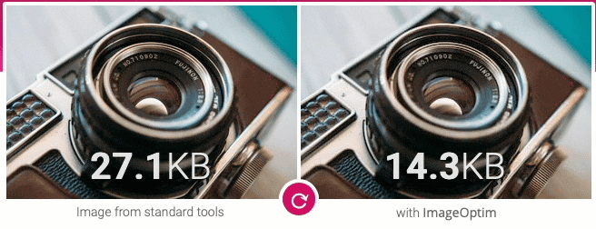
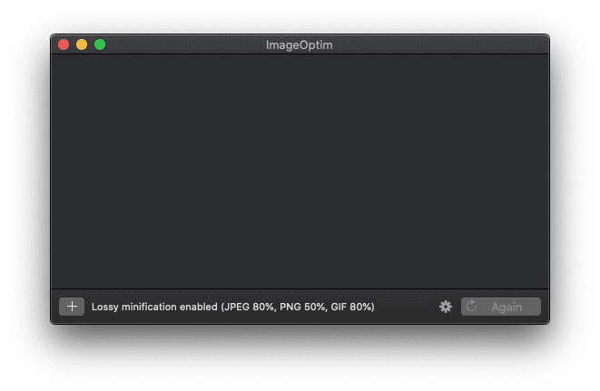
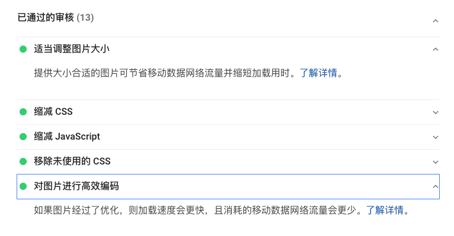

使用 Google 的 [Page speed](https://developers.google.com/speed/pagespeed/insights/) 对页面进行加载测试，发现图片的加载对页面的加载的拖延非常严重


## ImageOptim

此时需要对页面的图片进行优化，此处使用 [ImageOptim](https://imageoptim.com/mac) 进行图片压缩



导航到你的markdown索引的图片文件夹，并把里面的图片直接拖入 ImageOptim 就好了，同时压缩完会直接替换，直接commit新的优化的图片即可，原文件会被拉入垃圾箱可恢复，压缩可以在 ImageOptim 的 Preference 里面进行更大的压缩比设置




我通常是使用Mac的默认截图方式截图直接粘贴，默认是PNG，如果是这种方式，其实设置压缩比在50%都清晰可见


**修改Mac的默认截图方式**

在Terminal中的输入以下命令可以修改默认的截图格式，包括 Png/Jpg/pdf/gif

`$ defaults write com.apple.screencapture type jpg`


## Lazyload for Hexo-Next

Homepage : https://github.com/ApoorvSaxena/lozad.js

Demo : https://apoorv.pro/lozad.js/demo/

其原理在于把 img src 设置成 data-src，利用 IntersectionObserver API 来观察元素是否可见，进行动态加载

```html

```


对于Hexo-next的主题来说，已经内置了对lazyload的支持，直接在[theme_next]/_config.yml 找以下选项开启就行了

```yaml
# Vanilla JavaScript plugin for lazyloading images.
# For more information: https://github.com/ApoorvSaxena/lozad.js
lazyload: true
```

之后在进行 Google pagespeed 的测试就行了，实测效果不错



## Reference

_imageoptim_
https://imageoptim.com
_IntersectionObserver API 使用教程_
http://www.ruanyifeng.com/blog/2016/11/intersectionobserver_api.html
_IntersectionObserver API_
https://developer.mozilla.org/en-US/docs/Web/API/Intersection_Observer_API