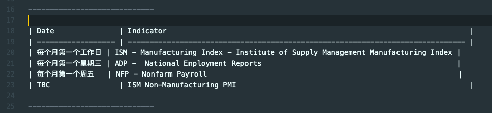

中文等宽字体，一个中文字符等宽两个英文字符，Mac下很多字体（ Menlo, Monaco, Courier New, Source Code Pro ）没有严格遵循或者说达不到这个标准, 它们不包括CJK的字库，有的时候用一些 markdown table formatter 会导致不整齐，其实并不是排列不整齐，而是字体的宽度不同  
​
即使排列好，但是中英文宽度没有对齐，就会不整齐  


使用了 Sarasa Mono SC, 排列就会变得整齐了, 而且并没有重新排列  


## Sarasa Gothic (更纱黑体 / 更紗黑體 / 更紗ゴシック / 사라사고딕)

SARASA GOTHIC, a CJK programming font based on Iosevka and Source Han Sans.  

**Installation**  
Download sarasa-gothic-ttf from https://github.com/be5invis/Sarasa-Gothic  
安装 Sarasa Mono SC，regular/light/bold/italy 即可  
在你需要用到这个字体的编辑器里面设置字体为 Sarasa Mono SC， Size 最好的16以上  


## Noto Sans CJK (思源黑体)  
2014年 Google 和 Adobe 宣布合作推出一款免费、开源的字体——思源黑体，也叫做 Source Han Sans 或 Noto Sans CJK。整套字体设计优雅，显示效果优秀    

思源黑体支持简体中文、繁体中文、日文、韩文以及英文；支持 ExtraLight、Light、Normal、Regular、Medium、Bold 和 Heavy 共7种字体粗细，可以满足不同场景下的文字显示需求。这个字体通过免费开源方式提供，支持多种语言，适合设计、开发人员甚至是普通用户下载和使用  

主页 （ https://www.google.com/get/noto/help/cjk/ ）上有比较详细的指引  
我使用了 Super OpenType/CFF Collection (Super OTC)  
Sans-serif	NotoSansCJK.ttc  


在编辑器里面设置 Noto Sans Mono CJK SC 即可 ...  


## TTC 和 TTF
在 更纱黑体 的 Release 下面有两种格式（ TTC 和 TTF ）, 它们的区别如下：
```
A TrueType Collection (TTC) is a means of delivering multiple TrueType fonts
in a single file structure. TrueType Collections are most useful when the
fonts to be delivered together share many glyphs in common. By allowing
multiple fonts to share glyph sets, TTCs can result in a significant saving
of file space.
For example, a group of Japanese fonts may each have their own designs for
the kana glyphs, but share identical designs for the kanji. With ordinary
TrueType font files, the only way to include the common kanji glyphs is to
copy their glyph data into each font. Since the kanji represent much more
data than the kana, this results in a great deal of wasteful duplication of
glyph data. TTCs were defined to solve this problem.
```

## J/K/SC/TC 的区别
字体后面的 J/K/SC/TC 分别对应日文、韩文、简体中文和繁体中文的汉字  

## Note
需要反思另一个问题，就是字体渲染效果是否符合你的审美，有时候不见得绝对等宽就是好，如果不用绝对等宽但是结果有个八成满意，但是同时字体更好看些，也是一种取舍, 但是这个问题要交由每个人去权衡 ...  


_还在继续测试中，如果随缘发现新的字体合适，我会再回来增补_

## Markdown in Visual Studio Code
等宽字体长期对着屏幕写代码其实并不舒服，所以可以把等宽中文限制只限制在markdown文档里面  
在 `~/Library/Application Support/Code/User/settings.json` 这个 vscode settings json 里面添加  

```
"[markdown]": {
    "editor.defaultFormatter": "yzhang.markdown-all-in-one",
    "editor.fontFamily": "Sarasa Mono SC, Noto Sans Mono CJK SC, monospace"
},
```


## Reference
_更纱黑体_  
https://github.com/be5invis/Sarasa-Gothic  

_思源黑体_
https://www.google.com/get/noto/help/cjk/

_Monospaced font_  
https://en.wikipedia.org/wiki/Monospaced_font  

_TrueType_  
https://en.wikipedia.org/wiki/TrueType  

_思源黑体的发布_
https://blog.typekit.com/alternate/source-han-sans-chs/

