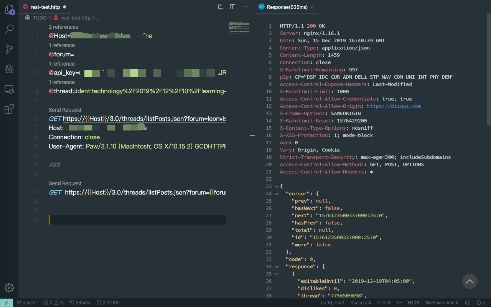

## GItlens

GitLens 可以在你的代码编辑区看到当前行的git log里面的修改情况，体验非常惊艳，开箱即用不用什么配置

```latex
Introduction from official website:

GitLens supercharges the Git capabilities built into Visual Studio Code. It helps you to visualize code authorship at a glance via Git blame annotations and code lens, seamlessly navigate and explore Git repositories, gain valuable insights via powerful comparison commands, and so much more.

Official website: 
https://marketplace.visualstudio.com/items?itemName=eamodio.gitlens
```

**Installation**

Open Visual Studio Code, press F1, type `Extensions: install` then search for rest-client.

_screenshot :_


## Rest Client for Vscode

Rest Client for Vsocde record all the request in plain text
* It can easily  be managed by version control system via git
* Define the variables in the context to resue both
* Code hinting for the key prarameters
  

**Installation**
1. Open Visual Studio Code, press F1, type ext install then search for rest-client.
2. Create a new file called rest-test.http and cover the sample as below, replace the value with your own.

**Sample**
```
@Host=disqus.com
@forum=shortname
@api_key=apikey
@thread=ident:technology%2F2019%2F12%2F10%2Flearning-how-to-reverse-proxy-disqus-api-in-nginx%2F

GET https://{{Host}}/3.0/threads/listPosts.json?forum=shortname&thread=ident:technology%2F2019%2F12%2F10%2Flearning-how-to-reverse-proxy-disqus-api-in-nginx%2F&api_key=apikey HTTP/1.1
Host: disqus.com
Connection: close
User-Agent: Paw/3.1.10 (Macintosh; OS X/10.15.2) GCDHTTPRequest

###

GET  https://{{Host}}/3.0/threads/listPosts.json Http/1.1
    ?forum={{forum}}
    &thread={{thread}}
    &api_key={{api_key}}

```
**Screeshot**  



## To be continue


## Reference
_Testing your API with REST Client_  
https://res.cloudinary.com/practicaldev/image/fetch/s--F1ngOkbZ--/c_limit%2Cf_auto%2Cfl_progressive%2Cq_auto%2Cw_880/https://techwatching.dev/posts/images/restclient_swapi_2.png  
_REST Client_  
https://marketplace.visualstudio.com/items?itemName=humao.rest-client
_Gitlens_
https://marketplace.visualstudio.com/items?itemName=eamodio.gitlens