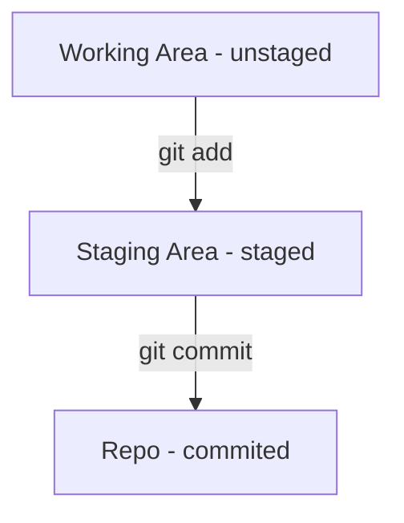

开玩笑地说，使用Git这种强大的版本管理工具，时刻要记得一句名言“ Know your place！”


## 	Git Phases

Git 最重要的三个 Phases 的理解对了解当前文件处于哪个工作区十分关键

1. `git add`  会使当前工作区的更改的文件状态从 unstaged 变成 staged
2. `git commit ` 会使当前工作区的更改的文件状态从 staged 变成 committed

下面的 Flowchart 结合常用命令可以清晰地理解




## Quick Book of Git

### Staged files

```bash
$git add [files]
```
### Commited Files
```bash
$git commit [files]
```
### Review the log

```bash
$git log
```

### Show  status

```bash
$git status
```

### Show difference in unstaged area

```bash
$git diff
```

```bash
leon:qzi.github.io leon$ git diff
diff --git a/source/_posts/finance/the-threshold-of-sp500.md b/source/_posts/finance/the-threshold-of-sp500.md
index dd45124..822c9cd 100644
--- a/source/_posts/finance/the-threshold-of-sp500.md
+++ b/source/_posts/finance/the-threshold-of-sp500.md
@@ -11,7 +11,7 @@ excerpt: ' 从 Tesla 的暴涨看 S&P 500 指数的长盛不衰，重点聊指


-
+test

S&P 500 为啥长生不衰

leon:qzi.github.io leon$ 
```

`--- a` 和 `--- b`是进行比较的源文件a和源文件b

`@@` 是 Chunk，代表这一个变更的集合块

`-`通常代表那行删除或者进行了更改前的内容

`+`通常代表那行是增加的或者进行了更改后的内容

### Show difference in staged area

```bash
$git diff --staged
```

### Unstaged the files

```bash
$git restore [files]
```
### List branches
```bash
$git branch
```
### Checkout and Create a new branch
```bash
$git checkout -b [branch name]
```
### Switch branch
```bash
$git checkout [branch name]
```

## Git integration with Vscode

**Config VSCode as the Editor**

```bash
$git config --global core.editor "code --wait"
```
**Install the Gitlens to view the commit message**

Press`Shift + Command + P`, then type `Install extentions`enter to find the Gitlens

 **Install the Git Graph to view the commit history**

Press`Shift + Command + P`, then type `Install extentions`enter to find the `Git Graph` or `Git history `as a alternative


_其实我只是想实验 Mermaid 的 flowchart 才写的这篇 つ﹏⊂_

_To Be Continue ..._


## Reference

_用 diff 来检查改动_
https://www.git-tower.com/learn/git/ebook/cn/command-line/advanced-topics/diffs