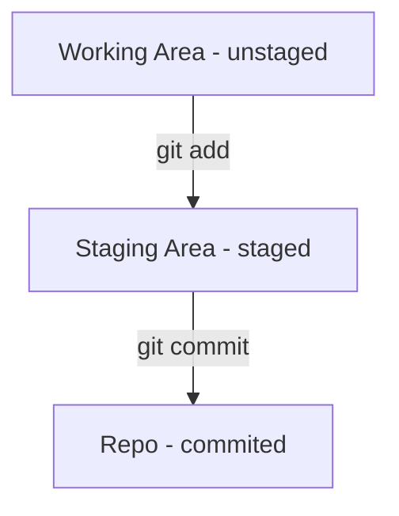

## 	Git Phases

Git 最重要的三个 Phases 的理解对了解当前文件处于哪个工作区十分关键

1. `git add`  会使当前工作区的更改的文件状态从 unstaged 变成 staged
2. `git commit ` 会使当前工作区的更改的文件状态从 staged 变成 committed

下面的 Flowchart 结合常用命令可以清晰地理解




## Quick Book of Git

### Staged Files
```bash
$git add [files]
```
### Commited Files
```bash
$git commit [files]
```
### Unstaged the files
```bash
$git restore [files]
```
### List branches
```bash
$git branch
```
### Checkout and create a new branch
```bash
$git checkout -b [branch name]
```
### Switch branch
```bash
$git checkout [branch name]
```

### Review the log

```bash
$git log
```

### Show Difference in unstaged area

```bash
$git diff
```


## Git integration with Vscode

**Config VSCode as the Editor**

```bash
$git config --global core.editor "code --wait"
```
**Install the Gitlens to view the commit message**

Press`Shift + Command + P`, then type `Install extentions`enter to find the Gitlens

 **Install the Git Graph to view the commit history**

Press`Shift + Command + P`, then type `Install extentions`enter to find the `Git Graph` or `Git history `as a alternative


_其实我只是想实验Mermaid的flowchart才写的这篇 つ﹏⊂_

_To Be Continue ..._


