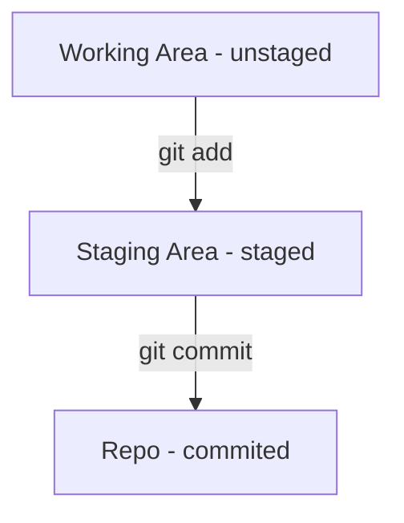
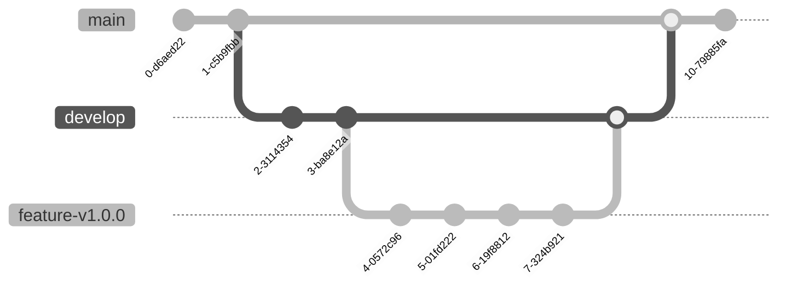

开玩笑地说，使用Git这种强大的版本管理工具，时刻要记得一句名言“ Know your place！”


## 	Git Process Flow

Git 最重要的三个 Phases 的理解对了解当前文件处于哪个工作区十分关键

1. `git add`  会使当前工作区的更改的文件状态从 unstaged 变成 staged
2. `git commit ` 会使当前工作区的更改的文件状态从 staged 变成 committed

下面的 Flowchart 结合常用命令可以清晰地理解




## Quick Book of Git

### Staged files

```bash
$git add [files]
```
### Commited files
```bash
$git commit [files]
```
### Show  status

```bash
$git status
```

### Review the log

```bash
$git log -p
```

### Git diff in the specific commit

```bash
❯ git log
commit 222a62a03a46a676019ef58fdacbaf6ab5677c20
Author: Leon Qiu <i@leonvision.online>
Date:   Wed Jul 13 21:04:48 2022 +0800

     test diff
     
❯ git diff 222a62a03a46a676019ef58fdacbaf6ab5677c20
diff --git a/.gitignore b/.gitignore
new file mode 100644
index 0000000..9f11b75
--- /dev/null
+++ b/.gitignore
@@ -0,0 +1 @@
+.idea/
diff --git a/testGit b/testGit
index c67ed73..6c4b8c7 100644
--- a/testGit
+++ b/testGit
@@ -1 +1,5 @@
 test git diff
+test git diff 3
+test git diff 2
+
+test branch
```


### Show differences between Woirking Directory and the Staging Area

```bash
$git diff
```

```bash
leon:qzi.github.io leon$ git diff
diff --git a/source/_posts/finance/the-threshold-of-sp500.md b/source/_posts/finance/the-threshold-of-sp500.md
index dd45124..822c9cd 100644
--- a/source/_posts/finance/the-threshold-of-sp500.md
+++ b/source/_posts/finance/the-threshold-of-sp500.md
@@ -11,7 +11,7 @@ excerpt: ' 从 Tesla 的暴涨看 S&P 500 指数的长盛不衰，重点聊指


-
+test

S&P 500 为啥长生不衰

leon:qzi.github.io leon$ 
```

`--- a` 和 `--- b`是进行比较的 文件版本a 和 文件版本b

`@@` 是 Chunk，代表这一个变更的集合块

`-`通常代表那行删除或者进行了更改前的内容

`+`通常代表那行是增加的或者进行了更改后的内容

如果是全新创建的文件，没有diff

​     

### Show differences in Staging Area and HEAD

```bash
$git diff --staged
```

```bash
Leon:qzi.github.io leon$ git diff --staged
diff --git a/source/_posts/miscellaneous/2019-ncov-abc.md b/source/_posts/miscellaneous/2019-ncov-abc.md
index 6302830..61c0c54 100644
--- a/source/_posts/miscellaneous/2019-ncov-abc.md
+++ b/source/_posts/miscellaneous/2019-ncov-abc.md
@@ -31,6 +31,7 @@ excerpt: ' 本文尝试普及 2019新型冠状病毒（2019-nCoV/SARS-COV2）的
 | 按电梯的按钮，用纸巾按，出门常备纸巾                         |
 | 家庭成员不要共用個人生活用品                                 |
 | 就餐时，公筷分餐，快进食，少说话                             |
+| 外出进门前注意鞋底在外可能踩踏吐痰等等中介传播物的路面的情况 |
```

 ## HEAD

`HEAD` – is a reference to a specific commit (normally to the the last commit in a local repository).

```bash
HEAD 说明：
HEAD 表示当前版本
HEAD^ 上一个版本
HEAD^^ 上上一个版本
HEAD^^^ 上上上一个版本
以此类推...

可以使用 ～数字表示
HEAD~0 表示当前版本
HEAD~1 上一个版本
HEAD^2 上上一个版本
HEAD^3 上上上一个版本
以此类推...
```


### Unstaged files

```bash
$git restore [files]
```

### Uncommited files    

```bash
$git reset –hard
```

### Untrack files

```bash
❯ git rm -r -n --cached package-lock.json
rm 'package-lock.json'

❯ git rm -r --cached package-lock.json 
rm 'package-lock.json'

❯ git status                             
On branch hexo
Changes to be committed:
  (use "git restore --staged <file>..." to unstage)
	deleted:    package-lock.json
	
❯ git commit 
[hexo 2a02d23] git rm --cached package-lock.json
 1 file changed, 9318 deletions(-)
 delete mode 100644 package-lock.json
```

-r 表示递归，-n 表示先不删除，只是列出文件。

   

## Basic Branch Mangement

Git graph based on mermaid



### List branches

```bash
❯ git branch
  feature-v1.1.0
* master

```
### Switch to the specific branch

```bash
❯ git checkout master
Switched to branch 'master'
```

### Create a new branch

```bash
❯ git branch feature-v2.0.0
❯ git branch
  feature-v2.0.0
* master

```

### Checkout and Create a new branch

```bash
❯ git checkout -b [branch name]
```
### Merge the branch

```bash
❯ git checkout master
Switched to branch 'master'
❯ git branch
  feature-v2.0.0
* master
❯ git merge feature-v2.0.0
Updating 9d87f34..7e66e0c
Fast-forward
 .gitignore  | 1 +
 test_branch | 3 +++
 2 files changed, 4 insertions(+)
 create mode 100644 .gitignore
```

### Delete the branch

```bash
❯ git branch
* master
❯ git branch feature-v3.0.0
❯ git branch
  feature-v3.0.0
* master
❯ git branch -d feature-v3.0.0
Deleted branch feature-v3.0.0 (was fc84191).
❯ git branch
* master
```


## .gitignore

```bash
❯ touch .gitignore
```

Add `.idea/` into .gitignore, then it can filter the files and folders under .idea/

## Basic Operation of Github

### Git clone

Clone from remote repo to local repo

```bash
❯ git clone https://github.com/theme-next/hexo-next-share.git
Cloning into 'hexo-next-share'...
remote: Enumerating objects: 50, done.
remote: Total 50 (delta 0), reused 0 (delta 0), pack-reused 50
Receiving objects: 100% (50/50), 10.82 KiB | 15.00 KiB/s, done.
Resolving deltas: 100% (23/23), done.
```

### Git push

Push the local repo to remote repo

```bash
❯ git push
Enumerating objects: 7, done.
Counting objects: 100% (7/7), done.
Delta compression using up to 8 threads
Compressing objects: 100% (4/4), done.
Writing objects: 100% (4/4), 27.55 KiB | 3.94 MiB/s, done.
Total 4 (delta 3), reused 0 (delta 0), pack-reused 0
remote: Resolving deltas: 100% (3/3), completed with 3 local objects.
To https://github.com/qzi/qzi.github.io.git
   c936aa8..fe09403  hexo -> hexo
```


## Git diff.tool && merge.tool

```bash
❯ git config --global merge.tool vimdiff
❯ git config --global diff.tool vimdiff
```


## Git integration with Vscode

**Config VSCode as the Editor**

```bash
$git config --global core.editor "code --wait"
```
**Install the Gitlens to view the committed message**

Press`Shift + Command + P`, then type `Install extentions`enter to find the `Gitlens`

_Gitlens_ : https://marketplace.visualstudio.com/items?itemName=eamodio.gitlens

**Install the Git Graph to view the commit history**

Press`Shift + Command + P`, then type `Install extentions`enter to find the `Git Graph` or `Git history `as a alternative 
_Git Graph_: https://marketplace.visualstudio.com/items?itemName=mhutchie.git-graph
_Git History_: https://marketplace.visualstudio.com/items?itemName=donjayamanne.githistory


Test

_其实我只是想实验 Mermaid 的 flowchart 才写的这篇 つ﹏⊂_

_To Be Continue ..._


## Reference

_用 diff 来检查改动_
https://www.git-tower.com/learn/git/ebook/cn/command-line/advanced-topics/diffs

_About Mermaid_
https://mermaid-js.github.io/mermaid/#/

_git reset 命令_
https://www.runoob.com/git/git-reset.html