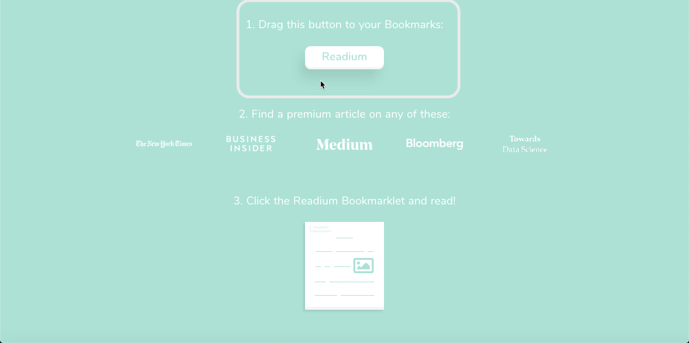

## Readium  

我记得在鲁迅的《孔乙己》的文章里面有这段话:

> 孔乙己便涨红了脸，额上的青筋条条绽出，争辩道，“窃书不能算偷……窃书！……读书人的事，能算偷么？” 接连便是难懂的话，什么“君子固穷”，什么“者乎”之类，引得众人都哄笑起来：店内外充满了快活的空气。

如是说的，似乎就是 Readium 这个工具，它能帮我这种处于不对称货币体系劣势下的的穷逼享受点美帝的优质服务（Medium, Bloomberg, New York Time ...)，开整 ...

### Step 1
访问 Readium 的主页, 将 Readium 那个 button 拖入 bookmark bar，搞定收工     
https://sugoidesune.github.io/readium/  

### Step 2
当访问 Bloomberg 等服务遭遇 Subscribe 的请求的时候，点一下Bookmark bar 收藏的 Readium 的按钮，搞定收工继续看了  

## Another Appoach 

Edward 贡献了另一个学习途径，好学的人真可怕 ... 

>medium 网站，当提示你说，免费阅读数量已超，请付费。  
>
>如果有登录，先登出  
>然后，打开 开发者工具， 在 Application 标签页， 把 这个网站的 cookie ，清除  
>
>刷新，你又可以继续免费阅读了  

## Note

咱们主要是知识型青年民工，除了学习研究，也要取之有道，支持体验完去正式订阅 ...  

## Reference
_孔乙己_  
https://zh.wikipedia.org/wiki/%E5%AD%94%E4%B9%99%E5%B7%B1  

_Readium_
https://sugoidesune.github.io/readium/  
