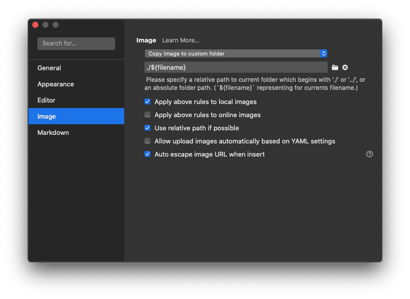

在 Hexo Next 的tg群里听到有人提到 Typora，刚好对在用的 Editor（VSCdoe - Markdown all in one，Evernote)都不太满意，实验了一下后发现这个 WYSIWYG（所见即所得）的 Markdown Editor 还挺好用，最优秀的地方就是对图片的处理已经比较完善，使用非常简单，官网文档已经足够，本文结合 Hexo 只是做些完善而已

Typora homepage
https://www.typora.io/


## Asset Management with Hexo
Hexo如果启用了 `post_asset_folder: true` 每次使用 scaffold创建一个新的文章的时候都会同时创建一个同名的目录用来放 asset，所以 Typora 最好根据这个行为习惯进行调整，Navigate to #Typora => #Preference



这样设置了后，每次图片从 clipboard 粘贴到 Typora 时就会自动把图片保存到对应的同名的 asset folder 下了

### Fixed asset link reference in Hexo

因为 Hexo 对图片的渲染并不支持原生的 markdwon 语法进行引用，所以需要借助 hexo-asset-link 来进行修复，这样上面  Typora 设置的图片索引路径才能在部署后被正确引用

**Installation**  

```bash
$ npm i --save hexo-asset-link
```

**Markdown Syntax support**

```Markdown

```


## Custom CSS in Typora

Typora 支持不同的主题文件（Github，Night ... 等等），一般已经够用，如果有叠加的调整需求，可以自定义CSS，在对应的Theme目录下了增加[theme_anme].user.css进行自定义修改


**Custom Github Style**

下面用对 Github 主题的 Image alignment 进行居左,这样在单个段落只有一张示例图的时候图片就不会居中了

```css
p .md-image:only-child{
    width: auto;
    text-align: left;
}
```


## Switch between source code mode and preview mode

最后还是需要聊聊其实我个人认为typora一个比较灵魂的一个地方，就是`Command + /`快捷键可以快速在Source code mode 和 preview mode之间切换，并且光标停留在当前状态，这在出来一些细节调整的时候非常有用，而且顺畅，可以慢慢体会 ... 


## Reference  
_insert image in typora_
https://support.typora.io/Images/
_custom typora css_
https://support.typora.io/Add-Custom-CSS/
_home of typora_
https://www.typora.io/
_enhance Image insert in hexo_
https://leonvision.online/technology/hexo-go/